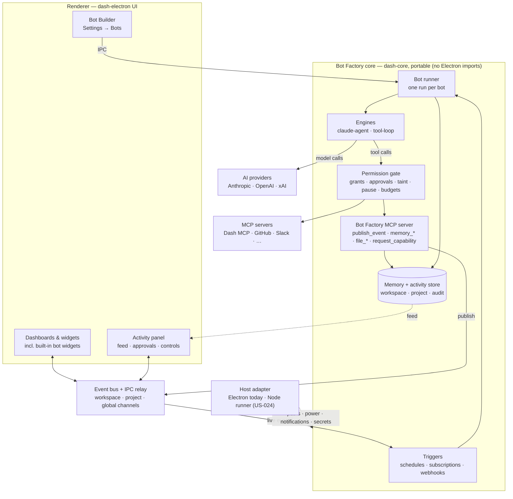
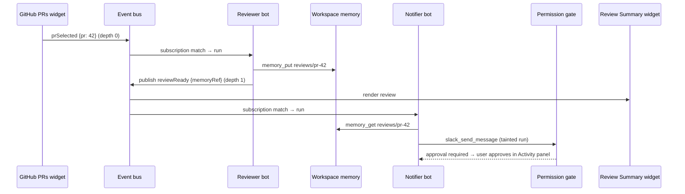

# PRD: Bot Factory — Persistent, Provider-Agnostic AI Bots

**Status:** Draft
**Last Updated:** 2026-09-27
**Owner:** John Giatropoulos
**Location:** dash-core (framework feature; Bots UI consumed by dash-electron)
**Related PRDs:** [mcp-providers.md](./mcp-providers.md), [dashboard-marketplace.md](./dashboard-marketplace.md), [bot-factory-use-cases.md](./bot-factory-use-cases.md), [bot-teams.md](./bot-teams.md) (dashboard teams, team leads, installable teams), dash-electron `docs/requirements/prd/ai-assistant.md`

---

## Executive Summary

Bot Factory lets Dash users create named, persistent AI bots, each with a role, a scoped set of MCP tools, a private working directory, and optional schedules, and then delegate recurring or long-running work to them. Bots run in the Electron main process through a pluggable **engine** layer, so each bot uses whichever AI provider the user designates (Anthropic/Claude, OpenAI, xAI/Grok, and future vendors). Bot Factory reuses dash-core's existing model provider registry, MCP server, grants, and consent systems, and surfaces in the UI through a bot roster, per-bot chat, and a universal **Bot Activity Manager** where the user sees everything bots are doing across all workspaces and can approve, stop, pause, or resume them. Bots act within a Dash workspace and form teams by joining Dash's existing event bus alongside widgets. Every event is stamped with its workspace and mirrored to a global stream for observation, while cross-workspace triggering is opt-in. Durable shared memory exists at two levels: **workspace memory** for a workspace's bots, and **project memory** shared by bots across workspaces that contribute to a larger project. Bots are headless by default, like providers: they are created in Settings, watched from a slide-over Activity panel, and appear on dashboards only through optional built-in widgets. A model advisor helps non-technical users pick the most efficient model and reasoning level for each bot. Bots are also a **registry asset**: bot templates can be published on their own or bundled into dashboard packages, so a user can install a complete working dashboard, bots included, in one step. Bots keep running when the Dash window is closed (background mode), stay within user-set budgets, and are built so the runner can later move into a standalone, OS-supervised process. The goal is a local-first equivalent of "AI coworker" products (e.g. xAI's Grok Bot), built on infrastructure Dash already has.

---

## Context & Background

### Problem Statement

**What problem are we solving?**

Dash's AI capabilities today are conversational and ephemeral. The AI Assistant panel and Chat widgets respond when a user types, but nothing keeps working after the user closes the conversation, and nothing runs on a schedule or reacts to events. A user who wants "every weekday at 7am, summarize my open PRs and unread Slack mentions into a dashboard card" has no way to express that inside Dash.

Users who need this today assemble it by hand: Claude Code run headlessly from cron or CI, custom scripts, and manually configured MCP access. That works for developers but isn't discoverable, isn't manageable from one place, and has no consistent permission or approval model.

Dash already has most of the ingredients (a local MCP server with 22+ tools, per-widget MCP grants, just-in-time consent, a scheduler dependency, and chat/tool-use UI). What's missing is a first-class "bot" object that ties them together with a runtime.

**Who experiences this problem?**

-   Primary: Developer/maker power users who already automate work with Claude Code and MCP
-   Secondary: Solutions Engineers who want repeatable prep work (demo data checks, account digests) done ahead of time

**What happens if we don't solve it?**

Automation stays outside Dash in ad-hoc scripts, the MCP server remains underused by non-interactive work, and Dash falls behind a fast-moving category of agent products that users will compare it against.

### Current State

**What exists today?**

-   **AI Assistant panel** (`src/AiAssistant/`) — interactive assistant with Dash MCP tool access
-   **ChatAnthropicWidget / ChatClaudeCodeWidget** — streaming chat with tool use
-   **Dash MCP server** — dashboard/widget/theme/provider tools at `http://127.0.0.1:3141/mcp`
-   **dash-core controllers** — `widgetMcpGrantsController`, `jitConsent`, `widgetMountTokenController`
-   **Scheduling** — `croner` dependency and `SchedulerWidget` sample
-   **Persistence** — `electron-store`
-   **Model provider registry** (`electron/llm/modelProviders.js`) — provider-pluggable model discovery; only `anthropic` implemented today
-   **LLM tool loop** (`electron/controller/llmController.js`) — Anthropic streaming + MCP tool-use loop with abort support
-   **OpenAI client** (`electron/controller/openaiController.js`) — `openai` SDK already a dependency
-   **Dashboard event bus** (`src/DashboardPublisher.js`) — widget pub/sub via `publishEvent` / `listen`, relayed across windows through the main process (`widget-event:broadcast`) with a last-event cache

**Limitations:**

-   No persistent agent identity, role, or memory across sessions
-   No way to run an agent unattended (scheduled or event-triggered)
-   MCP grants are scoped to widgets, not to autonomous agents
-   No central place to review and approve actions an agent wants to take
-   The existing tool loop is Anthropic-specific; users on other providers can't use agent features
-   The event bus is renderer-side and ephemeral; nothing in the main process can subscribe, and there is no durable shared state for agents to coordinate through

---

## Goals & Success Metrics

### Primary Goals

1. **Create a bot in minutes** — A user can go from nothing to a working, scheduled bot without writing code.
2. **Safe autonomy** — Bots only use tools they've been granted, and sensitive actions pause for approval.
3. **Continuity** — Bots resume prior context across runs and app restarts.
4. **Provider choice** — Each bot runs on the AI provider and model the user designates, with the same UI, grants, and approval flow regardless of provider.
5. **Teams of bots** — Bots and widgets collaborate through shared events and memory without any bot needing to know about the others; workspaces isolate teams by default, and projects connect them deliberately.
6. **Full oversight** — The user can see what every bot did, where, and why, and intervene at the run, bot, workspace, project, or global level.

### Success Metrics

| Metric                                  | Target                           | How Measured                         |
| --------------------------------------- | -------------------------------- | ------------------------------------ |
| Time to create first working bot        | < 3 minutes                      | Manual QA timing, E2E test           |
| Scheduled runs that complete without error | ≥ 95% over a 7-day dogfood period | Run log in bot store                 |
| Unapproved sensitive tool calls         | 0                                | Audit log review, permission tests   |
| Session resume success after restart    | 100% of bots with a prior session | Integration test                     |
| Providers passing the engine contract suite | Anthropic, OpenAI, xAI at launch | Engine contract tests (mocked + live smoke) |
| Runaway event chains                    | 0 (every chain stops at max depth) | Loop-prevention tests, activity log review |
| Time from "Pause all" to no bot executing tools | < 2 seconds (excluding in-flight model calls) | Integration test |
| Bot actions visible in the Activity Manager | 100%                              | Audit reconciliation test            |

### Non-Goals

-   **Truly always-on execution in v1** — v1 runs while Dash is running, including in the background with no windows (US-018), but not when Dash is fully quit or the machine is asleep. The headless runner (US-024) is P2; hosted cloud execution is out of scope.
-   **Waking a sleeping machine for schedules** — requires elevated privileges or is unreliable on laptops; missed schedules are handled by catch-up policies instead.
-   **A separate bot marketplace** — Bot templates are distributed through the existing Dash registry and dashboard packages (US-008, US-026, US-027), not a new marketplace surface.
-   **Identical capabilities on every provider** — Bots share one UI, grant model, and approval flow, but some engines offer more (e.g. built-in file/shell tools, skills via the Claude Agent SDK). Capability differences are surfaced, not hidden.
-   **Replacing the AI Assistant panel** — The assistant remains the interactive, single-session experience. Bots are for delegated, persistent work.

---

## User Personas

### Maker-Developer

**Role:** Independent developer who builds MCP servers and automates engineering workflows

**Goals:**

-   Delegate recurring chores (digests, triage, monitoring) to agents
-   Reuse existing MCP servers and Claude Code conventions (skills, CLAUDE.md)
-   See exactly what an agent did and why

**Pain Points:**

-   Headless Claude Code setups are scattered across cron jobs and scripts
-   No unified approval step before an agent takes external actions

**Technical Level:** Advanced

**Success Scenario:** Creates a "Morning PR Digest" bot that runs at 7am, reads GitHub and Slack via granted MCP tools, and updates a Dash widget, with no terminal involvement.

### Solutions Engineer

**Role:** Customer-facing SE preparing demos and account briefs

**Goals:**

-   Have demo environments sanity-checked before calls
-   Get account context summarized automatically

**Pain Points:**

-   Can't script automation themselves
-   Worried about agents taking actions in customer-visible systems

**Technical Level:** Intermediate

**Success Scenario:** Picks a template, grants read-only tools, and reviews the bot's output in its activity log before a call.

---

## User Stories

### Must-Have (P0)

**US-001: Create and configure a bot**

> As a maker-developer,
> I want to create a named bot with a role, instructions, and a set of granted tools,
> so that I can delegate a specific job to it.

**Priority:** P0
**Status:** Backlog

**Acceptance Criteria:**

-   [ ] AC1: Given Settings → Bots, when I click "New Bot," then the NewBotPicker offers templates or blank, followed by the Bot Builder (US-017) whose form covers name, role/instructions, provider/model (with recommendation, US-016), MCP servers, allowed tools, and approval policy.
-   [ ] AC2: Saving persists a bot definition matching the Bot Schema (see Architecture) and the bot appears in the roster.
-   [ ] AC3: A bot's private working directory is created under `app.getPath("userData")/bots/<botId>/files` (distinct from the Dash workspace it belongs to).
-   [ ] AC3a: Every bot belongs to exactly one Dash workspace, defaulting to the workspace the user is in when creating it.
-   [ ] AC4: Editing a bot updates its definition without discarding its session history.

**Edge Cases:**

-   Duplicate bot name → allowed; bots are keyed by generated `id`, names shown with disambiguation.
-   Bot granted an MCP server that is later removed → bot shows a warning badge and runs without that server.

**Technical Notes:**
Form built entirely from `@trops/dash-react` primitives (InputText, TextArea, Checkbox, Tabs, Panel) per the UI Component Rule.

**Example Scenario:**

```
User has Dash open with the GitHub and Slack MCP providers configured.
User creates "PR Digest" with instructions "Summarize my open PRs and review requests",
grants GitHub (read tools only), approval policy "ask before any write."
Expected: Bot appears in roster with status "Idle", workspace folder exists.
```

**Definition of Done:**

-   [ ] Code implemented and reviewed
-   [ ] Unit tests pass
-   [ ] Integration tests pass
-   [ ] Acceptance criteria verified
-   [ ] Documentation updated

---

**US-002: Run a bot and watch its work**

> As a maker-developer,
> I want to give a bot a task and see its progress stream in,
> so that I can trust what it's doing.

**Priority:** P0
**Status:** Backlog

**Acceptance Criteria:**

-   [ ] AC1: Given a bot, when I send it a message, then the runner starts the bot's engine with its config and streams normalized `BotEvent`s to the bot's chat view over IPC.
-   [ ] AC2: Tool calls and results render inline, reusing the Chat widget tool-use rendering.
-   [ ] AC3: I can stop a running bot; the runner aborts via `AbortController` and the bot returns to "Idle."
-   [ ] AC4: Each run is appended to the bot's activity log with start time, trigger, status, and a result summary.

**Edge Cases:**

-   Renderer window reloaded mid-run → run continues in main process; chat view reattaches and replays buffered messages.
-   SDK error or auth failure → run marked "Failed" with the error surfaced in the activity log.

**Technical Notes:**
The Claude Agent SDK is ESM-only (`"type": "module"`) while dash-core's electron code is CommonJS, so the `claude-agent` engine loads it with dynamic `import()`.

**Example Scenario:**

```
User opens "PR Digest" and types "Run now."
Expected: Status changes to "Running", tool calls to GitHub appear,
final summary appears within the chat, activity log gains one "Completed" entry.
```

**Definition of Done:**

-   [ ] Code implemented and reviewed
-   [ ] Unit tests pass
-   [ ] Integration tests pass
-   [ ] Acceptance criteria verified
-   [ ] Documentation updated

---

**US-003: Approve sensitive actions**

> As a solutions engineer,
> I want bots to pause and ask me before taking actions I haven't pre-approved,
> so that nothing happens in external systems without my say-so.

**Priority:** P0
**Status:** Backlog

**Acceptance Criteria:**

-   [ ] AC1: Tool calls not covered by the bot's `allowedTools` route through `requestPermission` (the Claude Agent SDK's `canUseTool` callback for `claude-agent`; before each tool execution for `tool-loop`), which creates a pending approval.
-   [ ] AC2: Pending approvals appear in the Bot Activity Manager's approvals queue (US-014) and in the bot's chat, showing bot, workspace, tool name, and input.
-   [ ] AC3: Approve resolves the request as allowed; Deny resolves it as denied with the user's message, which is returned to the model as the tool result, and the bot continues or stops accordingly.
-   [ ] AC4: Tools outside the bot's granted MCP servers are denied without prompting.
-   [ ] AC5: Every approval decision is recorded in the bot's audit log.

**Edge Cases:**

-   Approval pending when the app quits → run marked "Interrupted"; approval discarded; next run starts from the resumed session.
-   Approval not answered within a configurable timeout (default 24h) → auto-deny.

**Technical Notes:**
Reuse `jitConsent` UI patterns where possible. Bot grants extend the existing widget grant system (`grantedPermissions.js`, `permissionGate.js`, `widgetMcpGrantsController`) with a `bot` principal rather than introducing a parallel system.

**Example Scenario:**

```
"PR Digest" tries to post a Slack message, which is not in allowedTools.
Expected: Run pauses, the Activity Manager approvals queue shows "PR Digest wants to call slack_send_message"
with the message body. User approves; message posts; audit log records the approval.
```

**Definition of Done:**

-   [ ] Code implemented and reviewed
-   [ ] Unit tests pass
-   [ ] Integration tests pass
-   [ ] Acceptance criteria verified
-   [ ] Documentation updated

---

**US-004: Schedule a bot**

> As a maker-developer,
> I want a bot to run on a schedule,
> so that recurring work happens without me starting it.

**Priority:** P0
**Status:** Backlog

**Acceptance Criteria:**

-   [ ] AC1: A bot can have zero or more schedules, each a cron expression plus a task prompt.
-   [ ] AC2: The runner registers schedules with `croner` on app start and when a bot is saved.
-   [ ] AC3: Scheduled runs appear in the activity log with trigger "schedule."
-   [ ] AC4: A schedule that fires while the same bot is already running is skipped and logged, not queued.
-   [ ] AC5: Each schedule has a **catch-up policy** for occurrences missed while Dash was closed or the machine slept: `skip`, `once` (default: run once on next start/wake), or `all` (run each missed occurrence, capped at 5).
-   [ ] AC6: The runner records each schedule's last fire time and evaluates missed occurrences on startup and on system resume (Electron `powerMonitor` `resume`).

**Edge Cases:**

-   App was closed or machine asleep at scheduled time → handled by the catch-up policy; skipped occurrences are logged as "missed."
-   Invalid cron expression → validation error on save.

**Technical Notes:**
Schedules live in main process only; the renderer displays next-run time via IPC.

**Example Scenario:**

```
User adds schedule "0 7 * * 1-5" with prompt "Prepare today's PR digest."
Expected: At 7:00 on weekdays, bot runs; activity log shows trigger "schedule".
```

**Definition of Done:**

-   [ ] Code implemented and reviewed
-   [ ] Unit tests pass
-   [ ] Integration tests pass
-   [ ] Acceptance criteria verified
-   [ ] Documentation updated

---

**US-005: Bots remember prior work**

> As a maker-developer,
> I want each bot to pick up where it left off,
> so that it builds on previous runs instead of starting cold.

**Priority:** P0
**Status:** Backlog

**Acceptance Criteria:**

-   [ ] AC1: After each run, the runner stores the engine's session state on the bot record (Claude Agent SDK session ID for `claude-agent`; message history for `tool-loop`).
-   [ ] AC2: The next run passes that state back to the same engine, including after an app restart.
-   [ ] AC3: The user can "Reset memory," which clears the stored session ID (working-directory files remain unless also cleared).

**Edge Cases:**

-   Stored session no longer resumable → start a fresh session and log a warning.

**Definition of Done:**

-   [ ] Code implemented and reviewed
-   [ ] Unit tests pass
-   [ ] Integration tests pass
-   [ ] Acceptance criteria verified
-   [ ] Documentation updated

---

**US-006: Choose a bot's AI provider**

> As a maker-developer,
> I want to pick which AI provider and model each bot uses,
> so that I can use the subscriptions and models I already have.

**Priority:** P0
**Status:** Backlog

**Acceptance Criteria:**

-   [ ] AC1: The bot form lists only providers the user has configured credentials for (Anthropic, OpenAI, xAI at launch), with models from `modelProviders.listModels()`.
-   [ ] AC2: A new bot defaults to the user's designated default AI provider, with its model set to "Recommended" (US-016).
-   [ ] AC3: The same bot definition (instructions, grants, schedules, approval policy) runs on any supported provider; changing provider does not require re-creating the bot.
-   [ ] AC4: The form shows the selected engine's capabilities (e.g. "Built-in file & shell tools: Claude Agent engine only") so the user knows what changes between providers.
-   [ ] AC5: MCP tools and the approval gate behave identically on every engine.

**Edge Cases:**

-   Provider credentials removed → bot shows "Provider unavailable"; scheduled runs are skipped and logged, not silently moved to another provider.
-   Provider switched on a bot with history → the engine session does not transfer, but the new engine starts from a handover note built from run summaries (US-021); working-directory files and shared memory carry over.
-   Selected model retired → healed via `migrateModelId()` as elsewhere in dash-core.

**Technical Notes:**
See Engine Architecture below. Extend `PROVIDERS` in `modelProviders.js` with `openai` and `xai` entries; xAI exposes an OpenAI-compatible API, so both can share one engine with different base URLs.

**Example Scenario:**

```
User has Anthropic and xAI configured, with xAI set as default.
User creates "Inbox Triage"; provider defaults to xAI with its default model.
User later switches it to Anthropic / Claude.
Expected: Next run uses the Claude Agent engine with the same grants and schedules;
UI warns that prior conversation memory will not carry over.
```

**Definition of Done:**

-   [ ] Code implemented and reviewed
-   [ ] Unit tests pass
-   [ ] Integration tests pass
-   [ ] Acceptance criteria verified
-   [ ] Documentation updated

---

**US-014: Bot Activity Manager**

> As a maker-developer,
> I want one place to see everything every bot is doing across all workspaces and step in when needed,
> so that I stay in control as the number of bots grows.

**Priority:** P0 (core feed, approvals, run/bot/global controls); P1 (chain traces, workspace/project controls)
**Status:** Backlog

**Acceptance Criteria:**

-   [ ] AC1: A universal Activity Manager view in dash-core (also available as a widget) shows a live feed of runs, tool calls, events, memory writes, and approvals from every workspace.
-   [ ] AC2: The feed is filterable by workspace, project, bot, provider, status, and event name; each item shows which bot, in which workspace, did what, triggered by what.
-   [ ] AC3: It replaces the standalone approvals inbox: pending approvals are listed here with approve/deny, and a badge is visible from anywhere in Dash.
-   [ ] AC4: Run controls: stop (abort now) and pause/resume (halt at the next tool call, resume from the saved session).
-   [ ] AC5: Bot controls: pause/resume. A paused bot's schedules are skipped and its events follow its `whilePaused` policy.
-   [ ] AC6 (P1): Workspace and project controls pause/resume every bot in scope.
-   [ ] AC7: A global "Pause all bots" kill switch, reachable from the badge, stops new tool calls within 2 seconds.
-   [ ] AC8 (P1): Selecting any item opens its full chain trace (widget → bot → bot → widget), across workspaces, by `chain` IDs.
-   [ ] AC9: Every user intervention is itself recorded in the audit log.

**Edge Cases:**

-   Pause requested during a model call → the call completes, then the run halts before executing its next tool; status shows "Pausing…" until then.
-   Resume after app restart → paused runs resume from their saved session; if not resumable, they are marked "Interrupted" with an option to re-run.
-   Pause-all while approvals are pending → approvals stay pending; approving one does not resume its bot until the bot is resumed.

**Technical Notes:**
Pause is implemented at the permission gate: every engine already routes each tool call through `requestPermission`, which checks pause state before evaluating grants. The feed reads from the global observation stream plus the run and audit logs.

**Example Scenario:**

```
User notices the Notifier bot in "Work" posting too often.
User filters the Activity Manager to Notifier, sees 6 runs in 10 minutes
triggered by reviewReady, pauses the bot, and inspects the chain.
Expected: Notifier stops before its next tool call; new reviewReady events
queue; the pause appears in the audit log.
```

**Definition of Done:**

-   [ ] Code implemented and reviewed
-   [ ] Unit tests pass
-   [ ] Integration tests pass
-   [ ] Acceptance criteria verified
-   [ ] Documentation updated

---

**US-018: Background mode**

> As a maker-developer,
> I want my bots to keep running when I close the Dash window,
> so that scheduled and event-driven work doesn't depend on the dashboard being open.

**Priority:** P0
**Status:** Backlog

**Acceptance Criteria:**

-   [ ] AC1: When any bot has an active schedule or subscription, closing the last window keeps Dash running in the menu bar (macOS) / system tray (Windows, Linux) instead of quitting. A setting controls this (default on when bots exist).
-   [ ] AC2: The tray menu shows running bots and pending approvals, and offers Open Dash, Open Activity, Pause all bots, and Quit.
-   [ ] AC3: Optional "Start Dash at login (hidden)" via `app.setLoginItemSettings` on macOS/Windows and an autostart `.desktop` entry on Linux.
-   [ ] AC4: While a run is in progress, Dash holds an Electron `powerSaveBlocker` (`prevent-app-suspension`) so the run isn't frozen mid-way, releasing it when the run ends. Optional setting: "Keep awake while bots are scheduled (only when plugged in)."
-   [ ] AC5: Approval requests and failures while windows are closed raise native OS notifications (respecting Settings → Notifications); clicking opens the Activity panel on that item.
-   [ ] AC6: Quitting Dash with runs in progress asks to stop them or wait; stopped runs are marked "Interrupted."

**Edge Cases:**

-   Machine sleeps during a run → on resume the run continues if the provider stream survived, otherwise it is marked "Interrupted" and retried once per US-023.
-   User quits from the tray while bots are scheduled → confirmation explains that schedules pause until Dash starts again.

**Technical Notes:**
This keeps the runner in the Electron main process. It does not run bots when Dash is fully quit or the machine is asleep; see US-024 for the headless runner. On macOS, consider hiding the Dock icon while windowless (`app.dock.hide()`), restoring it when a window opens.

**Definition of Done:**

-   [ ] Code implemented and reviewed
-   [ ] Unit tests pass
-   [ ] Integration tests pass
-   [ ] Acceptance criteria verified
-   [ ] Documentation updated

---

**US-019: Budgets and cost controls**

> As a business user,
> I want spending limits on my bots,
> so that a busy or misconfigured bot can't run up an unexpected bill.

**Priority:** P0
**Status:** Backlog

**Acceptance Criteria:**

-   [ ] AC1: Every run records token usage and estimated cost (from provider usage data and pricing metadata).
-   [ ] AC2: Monthly budgets can be set per bot, per workspace, and globally.
-   [ ] AC3: At 80% of any applicable budget, the Activity Manager and a notification warn the user.
-   [ ] AC4: At 100%, affected bots auto-pause with reason "Budget reached"; in-progress runs stop at their next tool call.
-   [ ] AC5: The Activity Manager shows spend by bot, workspace, and provider for the current month.
-   [ ] AC6: Raising a budget or resuming a budget-paused bot requires an explicit user action and is audited.

**Edge Cases:**

-   Provider doesn't report usage for a call → estimate from token counts where possible; mark the figure as estimated.
-   Pricing unknown for a model → spend is tracked in tokens only and the budget UI says so.

**Definition of Done:**

-   [ ] Code implemented and reviewed
-   [ ] Unit tests pass
-   [ ] Integration tests pass
-   [ ] Acceptance criteria verified
-   [ ] Documentation updated

---

### Should-Have (P1)

**US-007: Built-in bot widgets**

> As a maker-developer,
> I want optional widgets that surface a bot on a dashboard,
> so that I can put bot output, status, or chat where I already look, or leave my dashboard clean.

**Priority:** P1
**Status:** Backlog

**Acceptance Criteria:**

-   [ ] AC1: dash-core ships built-in widgets: **Bot Output** (latest result, or a memory key, rendered as Markdown), **Bot Status** (state, last/next run, run/pause controls), **Bot Chat** (the bot's chat view), and **Activity Feed** (the Activity Manager feed, filterable, defaulting to the current workspace).
-   [ ] AC2: Each widget selects its bot the way widgets select providers today: a dropdown of bots in the widget's workspace.
-   [ ] AC3: Widgets are optional views. Adding or removing one never changes the bot's configuration or whether it runs.
-   [ ] AC4: Widgets respect workspace scope: they cannot bind to bots in other workspaces.
-   [ ] AC5: Bots granted the Dash MCP server can still update dashboards via existing tools.

**Edge Cases:**

-   Bound bot deleted or moved to another workspace → widget shows an empty state with "Choose a bot."
-   Bot Status controls used while a global "Pause all" is active → controls show the global pause and do not override it.

**Definition of Done:**

-   [ ] Code implemented and reviewed
-   [ ] Unit tests pass
-   [ ] Integration tests pass
-   [ ] Acceptance criteria verified
-   [ ] Documentation updated

---

**US-008: Start from a template**

> As a solutions engineer,
> I want to create a bot from a template,
> so that I don't have to write instructions from scratch.

**Priority:** P1
**Status:** Backlog

**Acceptance Criteria:**

-   [ ] AC1: The NewBotPicker offers templates from three sources: built-in (shipped with dash-core), installed (from registry packages), and a "Browse registry" tab listing `type: "bot"` packages.
-   [ ] AC2: Choosing a template opens the Bot Builder pre-filled from the template, with its install variables (US-026) shown as required fields.
-   [ ] AC3: A launch set of priority templates ships built in, drawn from [bot-factory-use-cases.md](./bot-factory-use-cases.md): PR Digest, PR Summarizer, Security Reviewer, Inbox Triage, Meeting Prep, Daily Brief, Error Watch, and Demo Check.
-   [ ] AC4: Any bot can be exported as a `.bot.json` template from BotDetail (secrets, sessions, memory values, and activity excluded).

**Definition of Done:**

-   [ ] Code implemented and reviewed
-   [ ] Unit tests pass
-   [ ] Integration tests pass
-   [ ] Acceptance criteria verified
-   [ ] Documentation updated

---

**US-009: Event triggers**

> As a maker-developer,
> I want bots to run in response to events (webhook, file change, Slack mention),
> so that they react to work as it arrives.

**Priority:** P1
**Status:** Backlog

**Acceptance Criteria:**

-   [ ] AC1: A bot can expose a local webhook endpoint that triggers a run with the request payload as context.
-   [ ] AC2: Event-triggered runs are logged with trigger type and source.

---

**US-010: Bots publish workspace-scoped events**

> As a maker-developer,
> I want bots to publish events onto the same bus widgets use, scoped to their workspace,
> so that widgets and bots in that workspace can react without affecting other workspaces.

**Priority:** P1
**Status:** Backlog

**Acceptance Criteria:**

-   [ ] AC1: Every bot has a built-in `publish_event` tool on every engine (served from Bot Factory's in-process MCP server).
-   [ ] AC2: Events are namespaced `bot:<ref>[<botId>].<eventName>`, matching the widget convention (`Component[itemId].event`), and delivered through the existing `widget-event:broadcast` relay. `ref` is the bot's **stable identity**, never its display name: the template's registry id when installed from a template (e.g. `@trops/inbox-tools/InboxTriage`), otherwise `local/<slug>` fixed at creation, so renames and multiple installs of one template don't break subscriptions. Tool-call events use portable names, `tool.<catalogType>.<toolName>` (e.g. `tool.gmail.search_emails`), never the user's provider name; run events are `completed` / `failed`.
-   [x] AC3: Every widget event is automatically stamped with `workspaceId`; widgets need no code changes because the publish helpers add it from the widget's context. (Bot-originated events: with US-010's emit work.)
-   [ ] AC4: A bot publishes to its own workspace by default. It may publish to a project channel (`channel: "project:<id>"`) only for projects it has write membership in, and to `global` only if granted.
-   [ ] AC5: A bot may only publish event names declared in its `publishes` list; payloads are validated against the declared schema.
-   [ ] AC6: Every event carries metadata: `source`, `runId`, `workspaceId`, `channel`, `chain` (causation IDs), and `depth`.
-   [ ] AC7: Every event, regardless of channel, is mirrored to the global observation stream (US-014).

**Edge Cases:**

-   Payload over size limit (default 64 KB) → rejected; bot is told to store the data in workspace or project memory and publish a reference instead.
-   Undeclared event name or unauthorized channel → tool returns an error to the model; nothing is published.

**Example Scenario:**

```
Reviewer bot in the "Work" workspace finishes a review and calls
publish_event("reviewReady", { pr: 42, memoryRef: "reviews/pr-42" }).
Expected: A Review Summary widget in "Work" renders it; a bot listening for
the same event in "Personal" does not run; the event appears in the Activity
Manager tagged "Work".
```

**Definition of Done:**

-   [ ] Code implemented and reviewed
-   [ ] Unit tests pass
-   [ ] Integration tests pass
-   [ ] Acceptance criteria verified
-   [ ] Documentation updated

---

**US-011: Bots subscribe to events**

> As a maker-developer,
> I want a bot to run when a widget or another bot publishes an event,
> so that bots can work as a team without a central orchestrator.

**Priority:** P1
**Status:** Backlog

**Acceptance Criteria:**

-   [ ] AC1: A bot definition can list `subscriptions`, each an event name (widget or bot), a task prompt, and a `scope`; matching events start a run with trigger "event."
-   [ ] AC2: `scope` defaults to `"workspace"` (the bot's own workspace). `"project:<id>"` matches that project's channel and requires project membership. `"workspaces:[ids]"` or `"global"` match events from other workspaces and require an explicit cross-workspace grant.
-   [ ] AC3: The main process subscribes on the bots' behalf by tapping the existing `widget-event` relay, so bots hear events whether or not their dashboard is open.
-   [x] AC4: The event payload is passed to the model as clearly labeled, untrusted data, never merged into the bot's instructions.
-   [ ] AC5: Cached/replayed events never trigger runs; only live events do.
-   [x] AC6: Loop prevention across workspaces: runs are refused when `depth` exceeds the max chain depth (default 5) or when the bot already appears in the event's `chain`.
-   [ ] AC7: Per-subscription debounce (default 2s, coalescing to the latest payload) and a per-bot rate limit (default 20 event-triggered runs/hour).
-   [ ] AC8: Events for a paused bot follow its `whilePaused` policy: `"queue"` (default, delivered on resume, coalesced per subscription) or `"drop"` (logged as skipped).
-   [x] AC9: The bot form lists subscribable events for the chosen scope, built from widgets' declared `events` and other bots' `publishes`. _(Bots' events are derived from their providers + tools rather than a hand-declared `publishes` list — see notes below.)_

**Implementation notes — event picker, widget events (2026-10-01):**

-   "Run on events" is a pick-only cascade, **Dashboard › Widget › Event**, built from each dashboard's widgets and their `.dash.js` `events` (`src/Components/Settings/details/eventCatalog.js`, same source as Dashboard Config → Listeners). Free-text event names are gone; dashboards sharing a name are numbered.
-   A subscription stores the runtime `eventType` (`Component[itemId].event`) plus a structured `source: { kind, ref, instanceId, event, workspaceId }` and a `label`. Template export (US-026) keeps `ref` + `event` and drops local ids; install re-resolves them (or `ref[*]`). Saved subscriptions whose widget is gone show "widget missing".
-   **Dashboard scoping:** copied dashboards reuse widget ids, so identical `eventType`s came from several dashboards. Widget events are now stamped with their dashboard (`DashboardPublisher.pub` meta → IPC → relay → `botController.handleEvent`), and a subscription with `source.workspaceId` only matches events from that dashboard (`eventMatcher.sameDashboard`). Unstamped events and dashboard-less subscriptions still match (back-compat).

**Implementation notes — bot events (2026-10-01):**

-   **Identity:** every bot has an immutable `ref` (`BotStore`): `local/<slug of name at creation>` or a template's registry id; older bots get one on load. Events are `bot:<ref>[<botId>].<event>` (`electron/bots/botEvents.js`).
-   **What bots publish** (`BotEventPublisher`, wired in `botController`): `completed` (final text, last 8 KB), `failed` (error), and `tool.<providerType>.<tool>` per successful provider tool call (args + result, last 8 KB). Built-in agent tools and memory tools publish nothing. Payloads are keyed by `botId`, with `ref` and `botName` as labels. Events go to every window on `widget-event:broadcast` (widgets can listen) and to the bot dispatcher.
-   **Derived, not declared:** instead of a hand-written `publishes` list, a bot's events follow from its settings — Completed, Failed, and one per tool it may use (provider limit ∩ selection), named by provider TYPE so they're portable to templates.
-   **Loop guard (AC6):** every bot event carries `chain` (bot ids) and `depth`; `checkChain` refuses a bot already in the chain or at depth 5, and the refusal shows as a warning in the Activity feed. Bot→bot dispatch is deferred a tick so chains never recurse on the stack.
-   **Untrusted payloads (AC4):** the event-run prompt fences the payload in `<event_payload>` (a payload can't close the fence) and tells the bot to treat it as data, not instructions — for widget and bot events alike.
-   **Picker:** "Run on events" → **From: A dashboard widget / Another bot**; Another bot → **Bot › Event** (the bot being edited is excluded). A subscription to a deleted bot shows "bot missing".
-   **Not yet:** popout windows don't replay the last bot event (the replay cache lives in dash-electron's relay); `publish_event` (AC1, custom events) remains future work.

**Edge Cases:**

-   Event arrives while the bot is running → coalesced into one follow-up run after the current run finishes.
-   Subscribed-to widget, bot, workspace, or project deleted → subscription flagged as orphaned.
-   Depth, cycle, or rate limit hit → skipped run logged with the reason.

**Example Scenario:**

```
GitHub PRs widget in "Work" publishes prSelected { pr: 42 }.
Reviewer bot (scope: workspace) runs, writes reviews/pr-42 to workspace
memory, publishes reviewReady. Notifier bot drafts a Slack post and pauses
for approval.
Expected: One chain, depth 0 → 2, traceable in the Activity Manager.
```

**Definition of Done:**

-   [ ] Code implemented and reviewed
-   [ ] Unit tests pass
-   [ ] Integration tests pass
-   [ ] Acceptance criteria verified
-   [ ] Documentation updated

---

**US-012: Workspace memory**

> As a maker-developer,
> I want bots in the same workspace to share durable notes and results,
> so that they can build on each other's work instead of redoing it.

**Priority:** P1
**Status:** Backlog

**Acceptance Criteria:**

-   [ ] AC1: Every bot keeps private memory (its session and working directory, unchanged) and has read/write access to its workspace's memory.
-   [ ] AC2: Built-in tools on every engine: `memory_get`, `memory_put`, `memory_list` (by key prefix/tag), and `memory_delete`, each taking a `scope` (`"workspace"` default, or `"project:<id>"` per US-015).
-   [ ] AC3: Entries are `{ scope, key, value (JSON), tags, author botId, sourceWorkspaceId, runId, version, updatedAt, expiresAt? }`.
-   [ ] AC4: Writes to an existing key require the current `version` (optimistic concurrency); a stale write fails and returns the current value.
-   [ ] AC5: Every write and delete is recorded in the scope's audit log with author, workspace, and run, and surfaced in the Activity Manager.
-   [ ] AC6: A Memory view lets the user browse, edit, and delete entries by scope; widgets can read their workspace's memory through `window.dashApi`.
-   [ ] AC7: Memory content returned to a model is labeled as data written by bots, not instructions.

**Edge Cases:**

-   Entry larger than the per-entry cap (default 256 KB) → rejected with guidance to write a file in the bot's working directory and store a path.
-   Bot moved to another workspace → loses access to the old workspace's memory; its past entries remain, attributed to it.
-   Expired entries → hidden from reads and purged on the next compaction.

**Technical Notes:**
Memory tools are served from Bot Factory's in-process MCP server, so they work identically on `claude-agent` and `tool-loop` engines, which is also how bots on different providers share knowledge.

**Definition of Done:**

-   [ ] Code implemented and reviewed
-   [ ] Unit tests pass
-   [ ] Integration tests pass
-   [ ] Acceptance criteria verified
-   [ ] Documentation updated

---

**US-015: Projects spanning workspaces**

> As a maker-developer,
> I want bots in different workspaces to contribute to one larger project,
> so that each bot stays confined to its workspace but works from shared project knowledge.

**Priority:** P1
**Status:** Backlog

**Acceptance Criteria:**

-   [ ] AC1: The user can create a project and link one or more workspaces to it.
-   [ ] AC2: Bots in linked workspaces can be made project members with `read` or `write` access; membership is never implicit.
-   [ ] AC3: Members use project memory via the standard memory tools with `scope: "project:<id>"`; every entry records its `sourceWorkspaceId`.
-   [ ] AC4: Each project has an event channel (`project:<id>`); write members may publish to it, and members may subscribe to it.
-   [ ] AC5: Project membership grants shared knowledge and signals only. A bot's tools, MCP grants, and actions remain confined to its own workspace.
-   [ ] AC6: Unlinking a workspace removes its bots' project access; their past entries remain, attributed.
-   [ ] AC7: The Activity Manager can filter and pause by project.

**Edge Cases:**

-   Two bots in different workspaces write the same key concurrently → second write fails on version check and receives the current value to reconcile.
-   Project deleted → user chooses to archive (read-only export) or delete its memory; subscriptions to its channel are flagged orphaned.

**Example Scenario:**

```
Project "Dash 2.0" links the "Frontend" and "Backend" workspaces.
An API bot in Backend writes project memory "api/contracts/widgets" and
publishes contractChanged on project:dash-2.0.
A UI bot in Frontend (read member, subscribed to the project channel) runs,
reads the contract, and updates Frontend's widgets only.
Expected: Neither bot can touch the other's workspace; both actions appear
under the project in the Activity Manager.
```

**Definition of Done:**

-   [ ] Code implemented and reviewed
-   [ ] Unit tests pass
-   [ ] Integration tests pass
-   [ ] Acceptance criteria verified
-   [ ] Documentation updated

---

**US-016: Model recommendations**

> As a business user who doesn't know which model to pick,
> I want Dash to recommend the right model and reasoning level for each bot,
> so that my bots are capable enough for the job without paying for more than they need.

**Priority:** P1 (recommend at creation); P2 (usage-based tuning, escalation)
**Status:** Backlog

**Acceptance Criteria:**

-   [ ] AC1: The model picker defaults to **"Recommended"**. The advisor re-evaluates when advice-relevant fields change (see US-017 AC6) and once on save; it analyzes the bot's instructions, tools, triggers, and expected frequency and proposes a **tier** (fast / balanced / deep) plus a **reasoning level** (low / medium / high).
-   [ ] AC2: The advisor maps the tier to a concrete model on the bot's own provider using tier metadata in the provider registry (e.g. for Anthropic: Haiku → fast, Sonnet → balanced, Opus → deep), so recommendations work for any provider.
-   [ ] AC3: The recommendation shows a one-sentence plain-language rationale and an estimated cost per run and per month at the configured schedule.
-   [ ] AC4: The user can accept or override; the chosen model, reasoning level, and whether it was recommended are stored on the bot.
-   [ ] AC5: The advisor itself runs on a fast-tier model of the user's default provider, and never runs without a configured provider.
-   [ ] AC6 (P2): After a bot has at least 10 runs, the advisor reviews actual usage (turns, tool calls, failures, approvals denied, cost) and suggests a change, e.g. "All 14 runs finished in 2 turns with no errors; a fast-tier model would cut cost about 70%." Suggestions appear in the Activity Manager and BotDetail; nothing changes without the user's confirmation.
-   [ ] AC7 (P2): Optional **escalation**: a bot can run on a fast model and retry once on the next tier up if the run fails or the bot calls a built-in `escalate` tool, with the escalation logged.
-   [ ] AC8 (P2): Per-trigger overrides: a subscription or schedule may specify its own tier (e.g. fast for triage, deep for weekly analysis).

**Edge Cases:**

-   The bot's instructions are ambiguous about depth (e.g. "look at the PR" could mean summarize or review for bugs) → the advisor asks one clarifying question in the form rather than guessing.
-   A recommended model is retired → healed via `migrateModelId()`, and the bot is flagged for re-recommendation.
-   The provider offers only one model → the advisor recommends reasoning level only.

**Example Scenario:**

```
User creates "PR Summarizer": "Summarize each new PR into three bullets."
Expected: Recommended → fast tier (Anthropic: Haiku), low reasoning,
"Summarizing is straightforward extraction; a fast model handles it well."

User creates "Security Reviewer": "Review each PR for vulnerabilities and
unsafe patterns before merge."
Expected: Recommended → deep tier (Anthropic: Opus), high reasoning,
"Finding subtle security issues benefits from careful reasoning."
```

**Definition of Done:**

-   [ ] Code implemented and reviewed
-   [ ] Unit tests pass
-   [ ] Integration tests pass
-   [ ] Acceptance criteria verified
-   [ ] Documentation updated

---

**US-017: Bot Builder (form + optional chat)**

> As a business user,
> I want to describe what I need in plain language and have Dash fill in the bot for me, while still seeing and controlling every setting,
> so that I can build a good bot without knowing how bots are configured.

**Priority:** P0 (form, Recommended model); P1 (chat co-pilot, Test tab)
**Status:** Backlog

**Acceptance Criteria:**

-   [ ] AC1: Creating or editing a bot opens the **Bot Builder** modal: the form on the left, an optional collapsible right pane with **Chat** and **Test** tabs (modeled on `WidgetBuilderModal`).
-   [ ] AC2: The form is the source of truth. A bot can be built entirely from the form with the right pane closed; saving always saves the form.
-   [ ] AC3 (P1): Chat proposes form changes as structured field patches. Changed fields highlight, with per-field undo and "Undo all from this message."
-   [ ] AC4 (P1): Each chat turn receives the current form state, so manual edits are respected and never silently overwritten.
-   [ ] AC5 (P1): Chat cannot change permissions on its own. Proposed changes to tools, MCP servers, grants, project membership, or cross-workspace subscriptions appear as pending suggestions the user must accept individually.
-   [ ] AC6: Advisor re-evaluation triggers only on advice-relevant fields (instructions, tools, triggers, schedule frequency), debounced and on blur, plus once on save. Name, description, and cosmetic fields never trigger it.
-   [ ] AC7: In "Recommended" mode, the model updates automatically with a short note on why. After a manual model choice, the model stays fixed and a non-blocking hint appears if the advisor now recommends a different tier.
-   [ ] AC8 (P1): When chat is open, advisor reasoning appears in the conversation; when closed, it appears as the inline rationale under the model field.
-   [ ] AC9 (P1): The **Test** tab runs the draft bot once against sample or live input without saving, streaming the run like the bot view; test runs obey grants and approvals and are labeled "test" in the Activity Manager.
-   [ ] AC10: On narrow windows, the panes collapse into Form / Chat / Test tabs.

**Edge Cases:**

-   User edits a field while chat is mid-response → the incoming patch for that field is shown as a conflict ("Keep mine / Use suggestion") rather than applied.
-   No provider configured → form works; Chat and Recommended mode show a prompt to add a provider.
-   Unsaved changes on close → confirm discard.
-   Test run requests a tool that isn't granted yet → shown as a pending approval inside the Test tab.

**Example Scenario:**

```
User types in Chat: "Every morning, summarize my open PRs and post it to Slack."
Expected: Form fills name "PR Digest", instructions, schedule "0 7 * * 1-5",
model Recommended → fast tier with rationale in chat. GitHub read tools and
the Slack post tool appear as pending suggestions; the user accepts them.
User runs Test; the digest streams in the Test tab; user saves.
```

**Definition of Done:**

-   [ ] Code implemented and reviewed
-   [ ] Unit tests pass
-   [ ] Integration tests pass
-   [ ] Acceptance criteria verified
-   [ ] Documentation updated

---

**US-020: Shared built-in file tools**

> As a maker-developer,
> I want bots on every provider to work with files the same way,
> so that choosing OpenAI or Grok doesn't leave a bot without basic capabilities.

**Priority:** P1
**Status:** Backlog

**Acceptance Criteria:**

-   [ ] AC1: Bot Factory's MCP server provides `file_read`, `file_write`, `file_list`, and `file_search` to every engine, confined to the bot's working directory.
-   [ ] AC2: Paths are resolved and checked against the working directory; traversal and symlink escapes are rejected.
-   [ ] AC3: Shell execution is not part of the shared set; it is available only with explicit approval policy or inside a container (US-013).
-   [ ] AC4: The `claude-agent` engine may still use its native file tools, restricted to the same directory; the BotDetail capability summary reflects the effective toolset per engine.

**Definition of Done:**

-   [ ] Code implemented and reviewed
-   [ ] Unit tests pass
-   [ ] Integration tests pass
-   [ ] Acceptance criteria verified
-   [ ] Documentation updated

---

**US-021: Run summaries and provider handover**

> As a maker-developer,
> I want a bot to keep its context when I change its provider,
> so that switching providers doesn't make it forget everything.

**Priority:** P1
**Status:** Backlog

**Acceptance Criteria:**

-   [ ] AC1: At the end of every run, the runner stores a short, provider-neutral summary (task, actions taken, outcome, open items) in bot-private memory, generated by a fast-tier model.
-   [ ] AC2: When a bot's engine changes, the first run on the new engine receives a handover note built from recent summaries.
-   [ ] AC3: Run summaries appear in the Activity feed and are an input to usage-based tuning (US-016).
-   [ ] AC4: "Reset memory" clears summaries along with the engine session.

**Definition of Done:**

-   [ ] Code implemented and reviewed
-   [ ] Unit tests pass
-   [ ] Integration tests pass
-   [ ] Acceptance criteria verified
-   [ ] Documentation updated

---

**US-022: Taint-aware approvals**

> As a solutions engineer,
> I want bots to ask before acting after they've read outside content,
> so that instructions hidden in an email or web page can't make a bot act on my behalf.

**Priority:** P1
**Status:** Backlog

**Acceptance Criteria:**

-   [ ] AC1: Tools and event sources are classified as **untrusted input** (e.g. email, web fetch, external widget data, events from other bots) or not; MCP tools default to untrusted unless marked otherwise in grants.
-   [ ] AC2: Once a run receives untrusted input, it is marked **tainted** for the rest of the run.
-   [ ] AC3: In a tainted run, any write, send, or external-effect tool requires approval, even if it is in `allowedTools`.
-   [ ] AC4: The approval card states that the run is tainted and shows which input caused it.
-   [ ] AC5: Users can mark specific sources as trusted per bot (audited).

**Edge Cases:**

-   Scheduled digest bots that must post after reading external content → user can pre-approve a specific destination (e.g. one Slack channel) for tainted runs, rather than disabling taint checks.

**Definition of Done:**

-   [ ] Code implemented and reviewed
-   [ ] Unit tests pass
-   [ ] Integration tests pass
-   [ ] Acceptance criteria verified
-   [ ] Documentation updated

---

**US-023: Resilience: retries and fallback provider**

> As a maker-developer,
> I want bots to ride out provider hiccups,
> so that a brief outage or rate limit doesn't lose scheduled work.

**Priority:** P1 (retries); P2 (fallback provider)
**Status:** Backlog

**Acceptance Criteria:**

-   [ ] AC1: Transient errors (rate limits, timeouts, 5xx) retry with exponential backoff and jitter, up to 3 attempts, honoring provider retry-after headers.
-   [ ] AC2: Non-transient errors (auth, invalid request) fail immediately with a clear message.
-   [ ] AC3 (P2): A bot may name a fallback provider/model; after retries are exhausted, the run restarts on the fallback with a handover note (US-021), logged prominently.
-   [ ] AC4 (P2): Fallback runs count against the same budgets.

**Definition of Done:**

-   [ ] Code implemented and reviewed
-   [ ] Unit tests pass
-   [ ] Integration tests pass
-   [ ] Acceptance criteria verified
-   [ ] Documentation updated

---

**US-025: Capability requests and MCP server installation**

> As a business user,
> I want Dash to help me add a capability my bot needs when no installed MCP server provides it,
> so that I can extend my bots safely without knowing how MCP servers are installed.

**Priority:** P1 (detection, grant, curated catalog, custom server); P2 (MCP Registry, sandboxing)
**Status:** Backlog

**Acceptance Criteria:**

*Detection*

-   [ ] AC1: While building, the Bot Builder chat identifies needed capabilities that no granted server provides and raises them before save.
-   [ ] AC2: Every bot has a built-in `request_capability` tool (description + reason). It creates a **capability request** in the Activity Manager; it never installs or grants anything. The run continues without the capability or pauses, per the bot's `onMissingCapability` setting (`continue` default, or `pause`).

*Resolution ladder* (offered in this order, most trusted first)

-   [ ] AC3: **Installed but not granted** → propose a grant for this bot as a pending suggestion.
-   [ ] AC4: **In the curated catalog** (`mcpServerCatalog.json` / `knownExternalMcpServers.json`) → use the existing `install_known_mcp_server` flow and `InstallExternalMcpModal` (package, command, credential fields; user confirms).
-   [ ] AC5 (P2): **In the official MCP Registry** (mcp-providers PRD Phase 5) → show publisher, source repository, version, transport, required credentials, and verified-namespace status, with a "not curated by Dash" warning. Remote (HTTP/OAuth) servers are preferred over local stdio servers when both exist.
-   [ ] AC6: **User-supplied server** → existing `CustomMcpServerForm`, including OAuth.
-   [ ] AC7: **Nothing suitable** → say so plainly and suggest alternatives (webhook trigger, generic fetch server, different approach). Generating a custom MCP server is out of scope for this story.

*Installation guardrails*

-   [ ] AC8: Installs only ever use an exact catalog or registry entry selected by the user. Package names or commands appearing in model output are never installed directly.
-   [ ] AC9: Installed servers are pinned to a specific version with source and version recorded; `@latest` or unpinned commands are rejected for registry installs.
-   [ ] AC10: After install, Dash starts the server, lists its actual tools, and shows them for selection. The server begins with zero grants; read-only tools are preselected and write/external-effect tools are unchecked.
-   [ ] AC11: If the server fails to start or list tools, the install is rolled back and logs are shown.
-   [ ] AC12: Newly installed servers are classified as untrusted input by default for taint-aware approvals (US-022) until the user marks them trusted.
-   [ ] AC13: Updates that change a server's tool list require re-consent before bots can use new tools, reusing `grantStaleness`.
-   [ ] AC14 (P2): Unknown local (stdio) servers can optionally run inside a container (US-013).
-   [ ] AC15: Every capability request, install, grant, and rejection is recorded in the audit log and shown in the Activity Manager.

**Edge Cases:**

-   Same capability requested repeatedly by one bot → deduplicated into one open request with a count.
-   Server requires credentials the user doesn't have → request stays open with "Waiting for credentials"; bot behavior follows `onMissingCapability`.
-   Server installed via the headless runner (US-024) → the runner's environment must provide the required runtime (`npx`, `uvx`); a missing runtime is reported before install.
-   User declines → request closed as "Declined"; the bot is told the capability is unavailable if it asks again in the same run.

**Example Scenario:**

```
User in Bot Builder chat: "Also save each digest as a page in Notion."
Expected: Chat replies that no installed server can write to Notion, and that
the curated catalog has a Notion server. User opens the install modal,
connects Notion, and sees its tools; "create page" is unchecked by default,
user checks it and grants it to this bot only. The grant appears as an
accepted suggestion in the form; the audit log records the install and grant.
```

**Definition of Done:**

-   [ ] Code implemented and reviewed
-   [ ] Unit tests pass
-   [ ] Integration tests pass
-   [ ] Acceptance criteria verified
-   [ ] Documentation updated

---

**US-026: Bot templates as registry assets**

> As a bot creator,
> I want to publish a bot template to the Dash registry,
> so that others can install a proven bot instead of building it from scratch.

**Priority:** P1
**Status:** In Progress — a bot publishes to the registry as `type: "bot"` (bot-teams TEAM-006 slice 3a, 2026-10-05): portable definition, providers by type, never credentials/sessions/memory/ids. Not yet: model tiers, install variables, required/optional tools with purposes, high-risk flags, update diffs.

**Acceptance Criteria:**

-   [ ] AC1: A `.bot.json` template schema is defined (see Bot Template Schema): portable bot definition, install variables, declared requirements, and metadata. It never contains credentials, engine sessions, memory values, activity, or local IDs.
-   [ ] AC2: Requirements are declared, not granted: AI capability as a model **tier** and reasoning level (never a vendor model ID), MCP servers by catalog ID with version and the specific tools requested (each marked `required` or `optional`, with a plain-language `purpose` and, for optional tools, the feature lost without it), events published and subscribed (widget events referenced by package and widget name), and memory keys used.
-   [ ] AC3: **Install variables** (e.g. `{repo}`, `{slackChannel}`) are declared with type, label, and description, and substituted into instructions, triggers, and tool arguments at install.
-   [ ] AC4: Templates publish to the registry with `type: "bot"` through the existing publish workflow; a `shareable` flag gates publishing, as for dashboards.
-   [ ] AC5: Publishing validates the schema and flags high-risk combinations for the publisher and installer (e.g. reads untrusted input and sends external messages; requests shell access).
-   [ ] AC6: Installed bots record their source template and version. Template updates show a diff of instructions, triggers, and requested tools; newly requested tools require re-consent, and local edits are preserved or shown as conflicts.

**Edge Cases:**

-   Template requests an MCP server not in the curated catalog → installer resolves it through the capability ladder (US-025); the bot stays in setup until resolved or the user removes that requirement.
-   Template requires a tier the user's provider lacks (e.g. only one model) → nearest available tier is used and shown.
-   Template declares subscriptions to a widget the user hasn't installed → offered as an optional widget install; otherwise the subscription is flagged orphaned.

**Definition of Done:**

-   [ ] Code implemented and reviewed
-   [ ] Unit tests pass
-   [ ] Integration tests pass
-   [ ] Acceptance criteria verified
-   [ ] Documentation updated

---

**US-027: Dashboard packages include bots**

> As a dashboard consumer,
> I want to install a complete dashboard with its bots, widgets, and wiring in one step,
> so that I get a working team of bots without configuring each piece myself.

**Priority:** P1
**Status:** Backlog

**Acceptance Criteria:**

-   [ ] AC1: `.dashboard.json` (dashboard-marketplace PRD) gains a `bots` array holding embedded bot templates or registry references, plus bot↔widget wiring expressed with the dashboard's layout-local widget IDs, and an optional `project` block.
-   [ ] AC2: PublishDashboardModal gains an "Include bots" section listing the workspace's bots with checkboxes; included bots are exported as templates per US-026 (install variables suggested automatically for values like repo names and channels).
-   [ ] AC3: Before import, a single **review screen** shows everything the package will add: widgets, bots (instructions, tier, schedules, subscriptions), MCP servers and requested tools per bot, providers needed, and an estimated monthly cost at the declared schedules.
-   [ ] AC4: On import, the workspace is created, widgets installed, and bots created **in setup state**: not running, schedules and subscriptions inactive.
-   [ ] AC5: A **setup checklist** in the new workspace walks through what remains: fill install variables, configure the AI provider, connect MCP servers (via US-025), review each bot's requested access (US-029), and set budgets (defaulting to the package's suggestion, capped by the user's global budget).
-   [ ] AC6: Each bot activates only when its own checklist items are complete; the user can activate bots individually or all at once.
-   [ ] AC7: Bot↔widget wiring is remapped to the new workspace's widget instances at import; events and memory are scoped to the new workspace by default.
-   [ ] AC8: The post-install summary extends the dashboard summary: "3 widgets installed, 2 bots added (setup needed), 4 events wired, 2 MCP servers to connect."

**Edge Cases:**

-   User imports the same package twice → bots are created per workspace; nothing is shared unless the package declares a project and the user links it.
-   User declines a bot during review → it is skipped; wiring that targets it is dropped and reported.
-   Package bots exceed the user's remaining global budget → review screen warns before import.

**Example Scenario:**

```
User installs "Engineering Review Team" from the registry.
Review screen: GitHub PRs + Review Summary widgets; Reviewer bot (deep tier,
on prSelected) and Notifier bot (fast tier, on reviewReady, posts to Slack);
GitHub read tools and one Slack send tool; est. $6–12/month.
After import, the setup checklist asks for {repo} and {slackChannel},
connects GitHub and Slack, and shows each bot's tools to accept.
User activates both bots; clicking a PR produces a review and a Slack draft
awaiting approval.
```

**Definition of Done:**

-   [ ] Code implemented and reviewed
-   [ ] Unit tests pass
-   [ ] Integration tests pass
-   [ ] Acceptance criteria verified
-   [ ] Documentation updated

---

**US-028: Widgets recommend companion bots**

> As a widget developer,
> I want my widget to suggest bots that pair with it,
> so that users discover automation that makes the widget more useful.

**Priority:** P2
**Status:** Backlog

**Acceptance Criteria:**

-   [ ] AC1: A widget package's `.dash.js` config can declare `companionBots`: registry references or embedded templates, each marked optional.
-   [ ] AC2: After installing the widget, a non-blocking prompt offers its companion bots, opening the same review screen and setup checklist as US-027.
-   [ ] AC3: Companion bots are never installed without explicit user choice.

**Definition of Done:**

-   [ ] Code implemented and reviewed
-   [ ] Unit tests pass
-   [ ] Integration tests pass
-   [ ] Acceptance criteria verified
-   [ ] Documentation updated

---

**US-029: Install-time access review with partial grants**

> As a user installing a bot someone else published,
> I want to see exactly what access the bot asks for and grant only what I'm comfortable with,
> so that I stay in control even if that means the bot does less.

**Priority:** P1
**Status:** Backlog

**Acceptance Criteria:**

-   [ ] AC1: Installing a bot (from a template, a dashboard package, or a widget's companion list) shows an access review built on the existing widget preflight consent pattern (`WidgetPreflightReview`, declared vs granted in `grantedPermissions.js`), with one section per bot.
-   [ ] AC2: Each requested tool is a line with a checkbox, grouped by MCP server, showing the tool name, the publisher's `purpose`, whether it is read-only or has external effects, and for optional tools the feature lost if unchecked.
-   [ ] AC3: Defaults: all **required** tools are checked, including write/external-effect tools; **optional** tools are unchecked. The user can uncheck any tool. Write/external-effect tools are visually marked, and high-risk combinations flagged at publish (US-026 AC5) are highlighted again here.
-   [ ] AC3a: Checking a write/external-effect tool grants access to it, not unreviewed use: the bot's approval policy still applies at runtime (default `ask`), so external actions pause for approval unless the user later pre-approves them.
-   [ ] AC4: The user can **Install with selected access**, **Skip this bot** (in a package), or **Cancel**. Unchecking a required tool shows that the bot can't run without it and disables its activation, while still allowing the rest of the package to install.
-   [ ] AC5: Only checked tools are written to the bot's grants. Nothing is granted implicitly by the template, the package, or later updates.
-   [ ] AC6: A bot installed with partial access is labeled **Limited** in the bot list and BotDetail, with a list of disabled features, and its capability summary is added to the run context so the model plans around unavailable tools instead of attempting them.
-   [ ] AC7: If a limited bot still calls a denied tool, the permission gate denies it without prompting, the model receives "tool not granted," and the Activity Manager logs it. A pattern of repeated attempts surfaces as a single capability request (US-025), never a repeated prompt.
-   [ ] AC8: The user can revisit access at any time in BotDetail → Tools & Grants, granting or revoking individual tools; changes take effect on the next tool call.
-   [ ] AC9: The same review appears when a template update requests new tools (US-026 AC6), showing only the new requests.

**Edge Cases:**

-   Two bots in one package request the same tool → shown under each bot; grants are per bot, so granting one does not grant the other.
-   A tool is already granted to the user's other bots → shown as "Also used by 2 of your bots" for context, but still requires a per-bot check.
-   Template marks a write tool as required (e.g. a notifier that must post to Slack) → it is checked by default like every required tool and marked as an external effect; if the user unchecks it, the bot shows as not runnable until it is re-granted or the bot is skipped.

**Example Scenario:**

```
User installs "Engineering Review Team".
Access review, Notifier bot:
  Slack · send_message  (required, external effect)   [x] — "Posts review summaries to {slackChannel}"
  Slack · add_reaction  (optional, external effect)   [ ] — "Without it: no ✅ reaction on reviewed PR threads"
Reviewer bot:
  GitHub · get_pull_request      (required, read-only) [x]
  GitHub · create_review_comment (optional, write)     [ ] — "Without it: reviews stay in Dash; nothing posted to GitHub"
User keeps the defaults and installs.
Expected: Reviewer runs read-only (Limited: "No GitHub comments");
Notifier posts to Slack after approval but never reacts to threads.
```

**Definition of Done:**

-   [ ] Code implemented and reviewed
-   [ ] Unit tests pass
-   [ ] Integration tests pass
-   [ ] Acceptance criteria verified
-   [ ] Documentation updated

---

### Nice-to-Have (P2)

**US-013: Container isolation**

> As a maker-developer,
> I want a bot to optionally run inside a Docker container,
> so that it can use a shell and filesystem without touching my machine.

**Priority:** P2
**Status:** Backlog

---

**US-024: Headless bot runner**

> As a maker-developer,
> I want bots to run even when Dash is fully quit, or on another always-on machine,
> so that my bots are genuinely always on.

**Priority:** P2
**Status:** Backlog

**Acceptance Criteria:**

-   [ ] AC1: The runner, engines, stores, scheduler, and event bridge can run as a standalone Node process (`dash-bot-runner`) with no Electron dependency.
-   [ ] AC2: Dash can install and remove an OS-level supervisor for it, per platform: a per-user **launchd LaunchAgent** on macOS (`RunAtLoad`, `KeepAlive`), a **systemd user service** on Linux (`Restart=always`, optional `loginctl enable-linger`), and a **Task Scheduler** task at logon with restart-on-failure on Windows.
-   [ ] AC3: Scheduling stays in the runner (`croner`); the OS supervisor only keeps the runner alive. OS-native scheduling is not used, so schedules have one source of truth on every platform.
-   [ ] AC4: Only one runner is active: Dash first discovers a running headless runner (lock file + local socket) and connects to it as a client; otherwise it hosts the runner in-process.
-   [ ] AC5: Dash and the headless runner communicate over a local authenticated channel (Unix socket / named pipe, or localhost with a per-install token). The Activity panel, approvals, and Bot Builder work the same either way.
-   [ ] AC6: Approvals raised while no Dash window is connected use OS notifications from the runner, or wait in the queue until Dash connects.
-   [ ] AC7 (future): The same runner can be deployed to a home server or VPS, with Dash connecting remotely over an authenticated, encrypted channel.

**Technical Notes:**
The macOS supervisor is a LaunchAgent (runs in the user's session), not a LaunchDaemon (runs as root). launchd's `StartCalendarInterval` could schedule runs directly and fires missed jobs on wake, but it would split schedules between Dash and plist files and has no Linux/Windows equivalent with the same semantics, so it is intentionally not used for scheduling. Waking a sleeping machine for a schedule (`pmset`, Windows wake timers, `rtcwake`) requires elevated privileges or is unreliable on laptops; it is out of scope.

**Definition of Done:**

-   [ ] Code implemented and reviewed
-   [ ] Unit tests pass
-   [ ] Integration tests pass
-   [ ] Acceptance criteria verified
-   [ ] Documentation updated

---

## Feature Requirements

### Functional Requirements

**FR-001: Bot Store**

-   **Description:** CRUD for bot definitions, run history, and audit log, persisted via `electron-store` (migrate to SQLite if history volume requires).
-   **User Story:** US-001, US-005
-   **Priority:** P0
-   **Validation:** Unit tests for CRUD and schema validation; survives restart.

**FR-002: Bot Runner**

-   **Description:** Main-process service that executes bots through the engine selected by the bot's provider, one active run per bot, with normalized streaming to the renderer, abort support, and session resume.
-   **User Story:** US-002, US-005
-   **Priority:** P0
-   **Validation:** Integration test with a mocked SDK stream; manual run against a real bot.

**FR-003: Permission Gate**

-   **Description:** Engine-independent `requestPermission` implementation that enforces grants, auto-allows `allowedTools`, and creates pending approvals for everything else.
-   **User Story:** US-003
-   **Priority:** P0
-   **Validation:** Unit tests for allow / deny / pending paths; zero unapproved sensitive calls in E2E.

**FR-004: Scheduler**

-   **Description:** `croner`-based schedule registration with skip-if-running and missed-run logging.
-   **User Story:** US-004
-   **Priority:** P0
-   **Validation:** Unit tests with fake timers.

**FR-006: Engine Abstraction**

-   **Description:** A `BotEngine` interface and engine registry so the runner never calls a vendor SDK directly. Provider → engine mapping is declared in the provider registry.
-   **User Story:** US-006
-   **Priority:** P0
-   **Validation:** Shared contract test suite run against every engine.

**FR-007: Claude Agent Engine**

-   **Description:** Engine backed by `@anthropic-ai/claude-agent-sdk`, used for the `anthropic` provider. Provides SDK-native sessions, built-in file/shell tools, and skills.
-   **User Story:** US-002, US-005, US-006
-   **Priority:** P0
-   **Validation:** Contract suite + live smoke test.

**FR-008: Generic Tool-Loop Engine**

-   **Description:** Engine that runs its own agent loop over any chat model with tool calling: MCP tools via `@modelcontextprotocol/sdk`, provider calls via an adapter (OpenAI-compatible adapter covers OpenAI and xAI). Generalizes the loop in `llmController.js`. Sessions are stored by Bot Factory as message history.
-   **User Story:** US-005, US-006
-   **Priority:** P0
-   **Validation:** Contract suite + live smoke test per provider.

**FR-009: Event Bus Bridge**

-   **Description:** Main-process participation in the dashboard event bus: workspace stamping for all events, channels (workspace, project, global), a `publish_event` tool, scoped subscription matching on the `widget-event` relay, event metadata, debounce, rate limits, paused-bot queuing, loop prevention, and mirroring to the global observation stream.
-   **User Story:** US-010, US-011
-   **Priority:** P1
-   **Validation:** Unit tests for matching, debounce, depth/cycle refusal, replay exclusion; integration test for a widget → bot → widget chain.

**FR-010: Scoped Memory Store**

-   **Description:** Durable key/value store scoped to workspaces and projects, with versioned writes, TTLs, audit log, and in-process MCP tools; read access for widgets via `window.dashApi`.
-   **User Story:** US-012, US-015
-   **Priority:** P1
-   **Validation:** Unit tests for scoping, version conflicts, size caps, expiry; integration test with two bots on different engines sharing an entry.

**FR-011: Bot Activity Manager**

-   **Description:** Global observation stream, activity feed with filters and chain traces, approvals queue, and intervention controls at run, bot, workspace, project, and global levels; pause enforced at the permission gate.
-   **User Story:** US-003, US-014
-   **Priority:** P0 (feed, approvals, run/bot/global controls), P1 (traces, workspace/project controls)
-   **Validation:** Integration tests for pause/resume semantics and kill-switch latency; audit reconciliation test.

**FR-012: Projects**

-   **Description:** Project records linking workspaces, explicit bot membership (read/write), project memory scope, and project event channel.
-   **User Story:** US-015
-   **Priority:** P1
-   **Validation:** Unit tests for membership enforcement; integration test with bots in two workspaces sharing project memory without cross-workspace actions.

**FR-013: Model Advisor**

-   **Description:** Tier and reasoning recommendations from bot configuration, cost estimates from provider pricing metadata, usage-based tuning suggestions, optional escalation and per-trigger tiers. Requires tier, reasoning-support, and pricing metadata per model in `modelProviders.js`.
-   **User Story:** US-016
-   **Priority:** P1 (creation-time recommendation), P2 (tuning, escalation, per-trigger tiers)
-   **Validation:** Golden-set tests of bot descriptions → expected tiers; unit tests for tier mapping per provider and cost math.

**FR-014: Built-in Bot Widgets**

-   **Description:** Bot Output, Bot Status, Bot Chat, and Activity Feed widgets that bind to a bot like widgets bind to providers.
-   **User Story:** US-007
-   **Priority:** P1
-   **Validation:** Widget tests for binding, empty states, and workspace scoping.

**FR-015: Bot Builder**

-   **Description:** Split-view create/edit modal: form (source of truth), Chat co-pilot producing structured field patches with highlight/undo and gated permission suggestions, advisor triggers on relevant fields, and a Test tab for unsaved draft runs.
-   **User Story:** US-017
-   **Priority:** P0 (form), P1 (Chat, Test)
-   **Validation:** Unit tests for patch application, conflict handling, and trigger rules; E2E for chat-driven creation with permission acceptance.

**FR-016: Background Mode**

-   **Description:** Tray/menu bar residency, login item, power-save blocking during runs, schedule catch-up on start/resume, and OS notifications for approvals and failures.
-   **User Story:** US-004, US-018
-   **Priority:** P0
-   **Validation:** Integration tests with simulated `powerMonitor` suspend/resume; manual tests on macOS, Windows, Linux.

**FR-017: Budgets**

-   **Description:** Per-run usage and cost capture, monthly budgets at bot/workspace/global levels, warnings, auto-pause, and spend reporting.
-   **User Story:** US-019
-   **Priority:** P0
-   **Validation:** Unit tests for cost math and threshold behavior; integration test for auto-pause at cap.

**FR-018: Safety and Resilience**

-   **Description:** Shared file toolset with path confinement, run taint tracking with escalated approvals, retries with backoff, optional fallback provider, and run summaries with provider handover.
-   **User Story:** US-020, US-021, US-022, US-023
-   **Priority:** P1 (fallback provider P2)
-   **Validation:** Path-escape tests, taint propagation tests, retry classification tests, handover integration test.

**FR-019: Headless Runner**

-   **Description:** Standalone `dash-bot-runner` process with per-OS supervisors, single-runner discovery, and an authenticated local client channel.
-   **User Story:** US-024
-   **Priority:** P2
-   **Validation:** Runner boots in plain Node in CI; supervisor install/remove tests per platform; Dash connects to an existing runner.

**FR-020: Capability Requests and MCP Installation**

-   **Description:** Capability gap detection (Bot Builder and `request_capability`), a resolution ladder over existing grants, the curated catalog, the MCP Registry, and custom servers, with pinned installs, post-install tool selection, fail-closed grants, rollback on failure, and audit.
-   **User Story:** US-025
-   **Priority:** P1 (registry and sandboxing P2)
-   **Validation:** Unit tests that model-supplied package names never reach the installer; integration tests for install → tool listing → selective grant → rollback on failure.

**FR-021: Bot Templates and Packaging**

-   **Description:** `.bot.json` schema and validation, export from BotDetail, registry publishing (`type: "bot"`), dashboard package `bots` extension, review screen, install-time access review with partial grants (reusing the widget preflight consent pattern), Limited-bot labeling, setup checklist with per-bot activation, template update diffs with re-consent, widget companion bots.
-   **User Story:** US-008, US-026, US-027, US-028, US-029
-   **Priority:** P1 (companion bots P2)
-   **Validation:** Schema tests (no secrets/sessions/memory values ever exported); round-trip export → import; package import creates bots in setup state with zero grants; update diff and re-consent tests.

**FR-005: Bots UI**

-   **Description:** Settings → Bots section (NewBotPicker, BotDetail), Activity panel with per-bot drill-down and popout, workspace bot indicator, command palette entries, and Memory view, all built from `@trops/dash-react`. See UI Surfaces.
-   **User Story:** US-001–US-004
-   **Priority:** P0
-   **Validation:** E2E (Playwright) for create → run → approve flow.

### Non-Functional Requirements

**NFR-001: Performance**

-   Bots UI remains responsive (no main-thread blocking) with 3 bots running concurrently.
-   Concurrent run cap configurable (default 3); excess runs queue.

**NFR-002: Security**

-   API keys stored via Electron `safeStorage`, never in bot JSON exports.
-   Bot working directories confined via the engine's `cwd`; no bot is granted another bot's directory.
-   New IPC channels validated through `public/lib/ipcValidators.cjs`.
-   Event payloads and workspace/project memory are always presented to models as untrusted data, since widgets may surface external content (emails, web pages) that could contain prompt injection.
-   Shared memory rejects values matching the secret patterns already used for provider credentials; secrets never go in shared memory.

**NFR-003: Usability**

-   First bot creatable in under 3 minutes; pending approvals visible from anywhere via a badge.

**NFR-004: Accessibility**

-   Full keyboard navigation for roster, chat, and approvals; approval actions reachable without a mouse.

**NFR-005: Compatibility**

-   No change to existing dashboards, widgets, or the AI Assistant panel.
-   Runs on all platforms Dash currently ships for; Node ≥ 18 per the Agent SDK's engine requirement.
-   Existing Anthropic-only consumers of `modelProviders.js` and `llmController.js` keep working unchanged.

**NFR-006: Runner Portability**

-   The runner, engines, stores, scheduler, event bridge, and permission gate must not import `electron` directly. Electron-specific services (paths, `powerMonitor`, `powerSaveBlocker`, notifications, `safeStorage`, IPC) are injected through a small host interface, so the same code can run in-process today and as `dash-bot-runner` later (US-024).
-   Storage choice must work in both Electron and plain Node. Evaluate `node:sqlite` (built into recent Node, no native rebuild) against `better-sqlite3` (native module requiring separate Electron and Node builds).
-   Enforced by a lint rule and a CI test that loads the runner package in plain Node.

---

## User Workflows

### Workflow 1: Create and schedule a digest bot

**Trigger:** User opens Settings → Bots (or "New bot in this workspace" from the command palette), then "New Bot."

**Steps:**

1. User picks a template or blank in the Bot Builder, then either fills the form or describes the job in Chat, which populates the form; permission changes are accepted individually. Provider defaults to their designated provider and model to "Recommended."
1a. System recommends a model tier and reasoning level with a rationale and cost estimate; user accepts or overrides.
2. System validates and shows a summary of granted capabilities.
3. User adds a weekday 7am schedule and saves.
4. System persists the bot, creates its working directory, and registers the schedule; the bot list and workspace indicator show "Next run: tomorrow 7:00."
5. User runs the draft in the Test tab (or "Run now" after saving).
6. System opens the Activity panel on the bot view and streams the run; activity log records "Completed."

**Success State:** Bot visible in roster with a successful test run and next-run time.

**Error Scenarios:**

-   No API key configured → form blocks save with a link to provider settings.
-   Test run fails → error shown in activity log with a "Retry" action.

**Time Estimate:** Under 3 minutes.

---

### Workflow 2: Handle an approval

**Trigger:** A running bot calls a tool outside its `allowedTools`.

**Steps:**

1. System pauses the run and adds an item to the Activity Manager approvals queue; badge count increments.
2. User opens the Activity Manager and reviews the bot, workspace, tool name, and input.
3. User approves or denies (optionally with a note).
4. System resumes the run with the decision and records it in the audit log.

**Success State:** Run continues or ends cleanly; decision is auditable.

**Error Scenarios:**

-   Bot was stopped before the user responds → approval marked "Expired."

**Time Estimate:** Seconds, excluding user think time.

---

## Design Considerations

### UI/UX Requirements

**Principle: bots are headless by default.** Like providers, a bot is configured in one place and consumed optionally elsewhere. A bot never requires dashboard space.

**UI Surfaces**

| Surface                     | Where                                         | Purpose                                                                 |
| --------------------------- | --------------------------------------------- | ----------------------------------------------------------------------- |
| **Settings → Bots**         | New section in `AppSettingsModal`, beside Providers | Create, configure, and delete bots                                  |
| **Activity panel**          | Right slide-over (like `AiAssistantPanel`), opened from a navbar icon; can pop out to its own window | Watch all bot activity, drill into a bot, approve, and intervene |
| **Workspace indicator**     | Workspace tab bar                             | Show the current workspace's bot count, running state, and pending approvals |
| **Command palette**         | `DashCommandPalette`                          | "New bot in this workspace," "Open activity," "Pause all bots," jump to a bot |
| **AI Assistant**            | Existing panel via new Dash MCP bot tools     | "Make a bot that…" drafts a bot config for the user to confirm          |
| **Debug Console**           | Existing `EventMonitor`                       | Bot events and chain traces alongside widget events, for developers      |
| **Built-in widgets**        | Optional, added to any dashboard              | Bot Output, Bot Status, Bot Chat, Activity Feed (US-007)                 |

**Settings → Bots**

-   Same list-and-detail pattern as Providers: a list grouped by workspace, a **NewBotPicker** (templates or blank, modeled on `NewProviderPicker`), and a **BotDetail** (modeled on `ProviderDetail`).
-   Creating a bot while in a workspace defaults it to that workspace.
-   "New Bot" and "Edit" open the **Bot Builder** modal (US-017): form on the left, optional Chat / Test pane on the right. The form sections mirror BotDetail's tabs.
-   BotDetail tabs: **Setup** (name, instructions, provider, model with recommendation), **Tools & Grants** (reusing `ToolSelector` and `WidgetGrantRow`), **Triggers** (schedules, subscriptions, `whilePaused`), **Memory** (workspace and project entries it has written), **Projects** (memberships).
-   List rows show name, workspace, status (Idle / Running / Paused / Awaiting approval / Failed), provider and model as a Tag, last run, and next run.

**Activity panel**

-   Top level is the Activity Manager feed with filters (workspace, project, bot, provider, status, event) and the approvals queue.
-   Selecting a bot drills into its **bot view**: live run stream (text, tool calls, results), chat input, controls (run now, stop, pause/resume, reset memory), run history, and a link to its BotDetail.
-   Pop out to a separate window so developers can watch bots on a second screen while keeping dashboards clean.
-   The navbar icon carries a badge (pending approvals + running bots) and a one-tap "Pause all."

**Workspace indicator**

-   A small indicator in the workspace tab bar: bot count, a running dot, and an approval badge. Clicking opens the Activity panel filtered to that workspace.

**General**

-   All components from `@trops/dash-react`; missing primitives are added to dash-react first.

### Architecture Requirements

**Architecture overview**



**Team flow: widget → bot → bot → widget**




**Process layout**

-   **Host boundary:** bot logic lives in a portable package (e.g. dash-core `bots/`) that receives an injected `host` (paths, power, notifications, secrets, transport). The Electron host lives in `electron/bots/host.js`; a Node host is added with US-024.
-   **Grants:** bots are a new principal in the existing grant system. `permissionGate.js` gains a `bot` identity alongside widgets, so tool allow-lists and path containment are enforced by one gate; Bot Factory's `requestPermission` layers approvals, taint, pause, and budgets on top.
-   **Main process (dash-core `electron/bots/`):** `BotStore`, `BotRunner`, `BotScheduler`, `PermissionGate`, `engines/` (registry + engines).
-   **Renderer (dash-electron):** Bots UI communicating over namespaced IPC (`bots:list`, `bots:save`, `bots:run`, `bots:stop`, `bots:approve`, `bots:stream`).

**Engine Architecture**

The runner, store, scheduler, grants, and approval gate are provider-neutral. Everything vendor-specific sits behind one interface:

```js
/**
 * @typedef BotEngine
 * @property {string} id                         e.g. "claude-agent", "tool-loop"
 * @property {EngineCapabilities} capabilities
 * @property {(ctx: RunContext) => AsyncIterable<BotEvent>} run
 */

/**
 * RunContext (built by BotRunner, identical for every engine)
 *   bot, prompt, model, credentials,
 *   workingDir, workspaceId, mcpServers (already filtered by grants),
 *   session,                       // engine-owned resume state
 *   requestPermission(tool, input) // PermissionGate → Promise<allow|deny>
 *   signal                         // AbortSignal
 *
 * BotEvent (normalized stream the UI renders)
 *   { type: "text", text }
 *   { type: "tool_call", id, name, input }
 *   { type: "tool_result", id, output, isError }
 *   { type: "session", session }   // persisted for resume
 *   { type: "done", summary, usage }
 *   { type: "error", message }
 *
 * EngineCapabilities
 *   { builtInTools: boolean, skills: boolean, nativeSessions: boolean }
 */
```

**Engines at launch**

| Engine         | Providers                                  | How it works                                                                                                  | Extra capabilities                          |
| -------------- | ------------------------------------------ | ------------------------------------------------------------------------------------------------------------- | ------------------------------------------- |
| `claude-agent` | anthropic                                  | `query()` from `@anthropic-ai/claude-agent-sdk` (dynamic `import()`, ESM), `canUseTool` → `requestPermission` | Built-in file/shell tools, skills, native session resume |
| `tool-loop`    | openai, xai (and anthropic as a fallback)  | dash-core's own loop: MCP client lists tools → provider adapter calls model with tools → gate → execute → repeat | MCP tools only; sessions stored as message history |

The `tool-loop` engine uses small **provider adapters** that translate between MCP tool schemas and each vendor's tool-calling format. One OpenAI-compatible adapter (`openai` SDK with a configurable `baseURL`) covers both OpenAI and xAI; an Anthropic adapter can be lifted from `llmController.js`. Adding a vendor means adding a `PROVIDERS` entry plus, if it isn't OpenAI-compatible, one adapter.

**Provider registry extension** (`electron/llm/modelProviders.js`)

```js
openai: { id: "openai", label: "OpenAI", engine: "tool-loop", adapter: "openai-compatible", ... },
xai:    { id: "xai", label: "xAI (Grok)", engine: "tool-loop", adapter: "openai-compatible",
          baseURL: "https://api.x.ai/v1", ... },
anthropic: { ...existing, engine: "claude-agent" },
```

Each model entry also carries advisor metadata: `tier` (`fast` / `balanced` / `deep`), `reasoning` support (e.g. thinking budgets or effort levels, normalized to low / medium / high), and pricing for cost estimates. Engines translate the normalized reasoning level into each provider's native setting.

**Permission gate is engine-independent.** Every engine must route each tool call through `requestPermission` before executing it. The contract test suite asserts this, so a new engine can't bypass approvals.

**Scopes at a glance**

Bot Factory separates where a bot acts, what it knows, and what the user sees:

| Concern         | Scope                                                                                                  |
| --------------- | ------------------------------------------------------------------------------------------------------ |
| **Acts**        | Its own workspace only: tools, MCP grants, and dashboard changes never cross workspaces.               |
| **Knows**       | Bot-private (session + working directory) → workspace memory → project memory (explicit membership).   |
| **Hears**       | Its workspace by default; project channels by membership; other workspaces or global by explicit grant. |
| **Is seen**     | Everywhere: every event and action is mirrored to the global observation stream and Activity Manager.  |

**Event Bus Integration**

Today `DashboardPublisher` lives in the renderer and forwards events through the main process (`widget-event:broadcast`), which keeps a last-event cache. Bot Factory adds:

-   **Workspace stamping:** `DashboardPublisher.pub` adds the publishing widget's `workspaceId`; bot events get the bot's `workspaceId`. The main-process last-event cache is keyed by `workspaceId + eventType`.
-   **Channels:** `workspace:<id>` (default), `project:<id>`, and `global`. Delivery to widgets respects the channel: widgets receive events from their own workspace, plus project channels for projects their workspace is linked to.
-   **Inbound to bots:** every live event is matched against bot `subscriptions` by name and scope, then passes replay exclusion → loop check → paused check (`whilePaused`) → debounce → rate limit → runner.
-   **Outbound from bots:** `publish_event` validates the name against `publishes` and the channel against membership/grants, stamps metadata, and pushes through the relay.
-   **Global observation stream:** every event on every channel, plus run, tool-call, approval, memory, and intervention records, is appended to an activity log that feeds the Activity Manager. Observation never triggers runs.

**Envelope** (widget-originated events get `depth: 0`, `chain: []`):

```json
{
    "eventType": "bot:Reviewer[bot_01J...].reviewReady",
    "content": { "pr": 42, "memoryRef": "reviews/pr-42" },
    "meta": {
        "workspaceId": "ws_work",
        "channel": "workspace:ws_work",
        "source": "bot_01J...",
        "runId": "run_...",
        "chain": ["evt_prSelected_...", "run_..."],
        "depth": 1
    }
}
```

This is choreography rather than orchestration: bots only share event names and memory keys, never direct references to each other, so bots can be added, removed, or moved to another provider without rewiring anything.

**Memory Scopes**

Events and memory play different roles, and teams need both:

| Concern          | Event bus                                   | Workspace / project memory                            |
| ---------------- | ------------------------------------------- | ----------------------------------------------------- |
| Answers          | "What just happened?"                        | "What do we know?"                                     |
| Lifetime         | Ephemeral (last-value cache only)            | Durable across runs and restarts                      |
| Size             | Small signals (≤ 64 KB)                      | Results, notes, state (≤ 256 KB per entry)            |
| Typical use      | Triggering work, updating widgets            | Handing off large results, dedupe ("PR 42 already reviewed"), conventions, running state |

The common pattern is **write, then signal**: a bot writes its result to memory and publishes a small event carrying the key (`memoryRef`).

-   **Bot-private:** engine session + working directory (US-005). Invisible to other bots.
-   **Workspace:** shared by all bots in a workspace; readable by its widgets (US-012).
-   **Project:** shared by member bots across linked workspaces, with read or write access; entries record `sourceWorkspaceId` (US-015).

Storage: SQLite in dash-core's userData with tables for memory entries (keyed by scope + key), audit log, activity log, and projects. Chosen over `electron-store` for concurrent writes from parallel runs, prefix/tag queries, and feed filtering. Memory, publish, and project tools are served from the in-process Bot Factory MCP server (the Claude Agent SDK's `createSdkMcpServer` for `claude-agent`, a local MCP client connection for `tool-loop`), keeping them identical across providers.

**Intervention Model**

-   **Stop:** abort the run immediately via its `AbortSignal`.
-   **Pause:** set a pause flag at run, bot, workspace, project, or global level. `requestPermission` checks the flag before every tool call, so any engine halts at its next tool boundary; in-flight model calls finish first.
-   **Resume:** clear the flag; paused runs continue from their saved session, queued events are delivered (coalesced), and schedules missed while paused are logged as skipped (catch-up policy does not apply to user pauses).
-   Every intervention is written to the audit log and appears in the feed.

**Bot Template Schema (`.bot.json`, v1)**

A template is a portable, declarative bot. Everything user-specific is either a variable or resolved at install.

```json
{
    "schemaVersion": 1,
    "type": "bot",
    "name": "PR Reviewer",
    "version": "1.2.0",
    "author": "trops",
    "description": "Reviews the selected PR and publishes a summary.",
    "tags": ["engineering", "github"],
    "shareable": true,
    "variables": [
        { "key": "repo", "label": "Repository", "type": "string", "description": "owner/name" }
    ],
    "instructions": "Review pull requests in {repo}. Focus on correctness...",
    "model": { "tier": "deep", "reasoning": "high" },
    "requires": {
        "mcp": [
            {
                "catalogId": "github",
                "version": "1.4.0",
                "tools": [
                    { "name": "get_pull_request", "required": true, "purpose": "Read the PR being reviewed" },
                    { "name": "list_pull_request_files", "required": true, "purpose": "See which files changed" },
                    {
                        "name": "create_review_comment",
                        "required": false,
                        "purpose": "Post the review on GitHub",
                        "withoutIt": "Reviews stay in Dash; nothing is posted to GitHub"
                    }
                ]
            }
        ]
    },
    "publishes": [{ "name": "reviewReady", "schema": { "type": "object" } }],
    "subscriptions": [
        { "event": { "package": "@trops/github-prs", "widget": "GitHubPRs", "name": "prSelected" }, "scope": "workspace", "prompt": "Review PR {{event.pr}}." }
    ],
    "schedules": [],
    "memory": { "keys": ["reviews/*"] },
    "budget": { "suggestedMonthly": 10 },
    "approvalPolicy": "ask",
    "whilePaused": "queue"
}
```

Never included: credentials, provider or model IDs, engine sessions, run summaries, memory values, activity, grants, or local bot/workspace/widget IDs.

**Bot Schema (v1)**

```json
{
    "id": "bot_01J...",
    "name": "PR Digest",
    "instructions": "Summarize my open PRs and review requests.",
    "provider": "xai",
    "model": "<provider model id>",
    "modelSelection": {
        "mode": "recommended",
        "tier": "fast",
        "reasoning": "low",
        "rationale": "Summarizing is straightforward extraction."
    },
    "mcpServers": ["github", "dash"],
    "allowedTools": ["mcp__github__list_pull_requests"],
    "approvalPolicy": "ask",
    "schedules": [
        { "cron": "0 7 * * 1-5", "prompt": "Prepare today's PR digest." }
    ],
    "workspaceId": "ws_work",
    "projects": [{ "id": "proj_dash2", "access": "write" }],
    "whilePaused": "queue",
    "publishes": [
        { "name": "reviewReady", "schema": { "type": "object", "required": ["pr"] } }
    ],
    "subscriptions": [
        { "event": "GitHubPRs[*].prSelected", "scope": "workspace", "prompt": "Review the selected PR." },
        { "event": "*.contractChanged", "scope": "project:proj_dash2", "prompt": "Check the new API contract." }
    ],
    "session": { "engine": "tool-loop", "state": null },
    "createdAt": "2026-09-26T00:00:00Z",
    "updatedAt": "2026-09-26T00:00:00Z"
}
```

`provider: null` means "use the user's designated default provider at run time."

**Runner sketch**

```js
const provider = getProvider(bot.provider ?? userDefaultProvider());
const engine = engines.get(provider.engine);

const session =
    bot.session?.engine === engine.id ? bot.session.state : null;

for await (const event of engine.run({
    bot,
    prompt,
    model: migrateModelId(provider.id, bot.model),
    credentials: await credentialsFor(provider.id),
    workingDir: workingDir(bot.id),
    workspaceId: bot.workspaceId,
    mcpServers: grantedMcpServers(bot),
    session,
    requestPermission: (tool, input) => permissionGate.request(bot, tool, input),
    signal: abortController.signal,
})) {
    streamToRenderer(bot.id, event);
    if (event.type === "session") saveSession(bot.id, engine.id, event.session);
}
```

### Dependencies

**Internal:**

-   dash-core mcp-providers PRD Phase 5 (MCP Registry browser) — required for US-025 AC5

-   `@trops/dash-core/electron` — MCP grants, JIT consent, provider config
-   `@trops/dash-react` — all UI primitives
-   Dash MCP server (`http://127.0.0.1:3141/mcp`)

**External:**

-   `@anthropic-ai/claude-agent-sdk` (new dependency; ESM, Node ≥ 18) — `claude-agent` engine
-   `openai` (existing) — OpenAI-compatible adapter for OpenAI and xAI
-   `@anthropic-ai/sdk` (existing) — Anthropic adapter for `tool-loop` fallback
-   `@modelcontextprotocol/sdk` (existing) — MCP client for `tool-loop`
-   `croner` (existing)
-   `node:sqlite` or `better-sqlite3` (new) — memory, activity, audit, and project store; see NFR-006 for the portability trade-off
-   `electron-store` (existing)

---

## Open Questions & Decisions

### Open Questions

1. **Q: How are provider credentials and the user's default provider stored?**

    - Context: Today the Anthropic key comes from a dashboard provider; bots need keys for several vendors plus a "designated default."
    - Options: (A) Reuse dashboard providers per vendor and add a global default setting. (B) A dedicated AI Providers settings section in dash-core.
    - Status: Open

2. **Q: Should the Anthropic provider also support Claude Code login (no API key)?**

    - Context: ChatClaudeCodeWidget works without an API key via the Claude Code CLI; the Agent SDK is built on the same runtime.
    - Options: (A) API key only. (B) API key or existing Claude Code login.
    - Status: Open

3. **Q: Beyond handover notes (US-021), should `tool-loop` history be replayed verbatim when switching between `tool-loop` providers?**

    - Context: `tool-loop` history is plain messages and could be replayed into another provider; Claude Agent SDK sessions are opaque.
    - Options: (A) Handover note only. (B) Verbatim replay between `tool-loop` providers, handover note otherwise.
    - Status: Open

4. **Q: Should widgets be able to write to workspace memory, or only read?**

    - Context: Writable memory lets a widget act as a control panel for a workspace's bots (e.g. a "priorities" note), but widens the write surface.
    - Options: (A) Read-only for widgets in v1. (B) Write access granted per widget, like MCP grants.
    - Status: Open

5. **Q: Is keyword/prefix lookup enough for workspace and project memory, or is semantic search needed?**

    - Context: Semantic search needs embeddings, which are provider-specific.
    - Options: (A) Prefix/tag lookup in v1. (B) Optional embeddings via the user's default provider.
    - Status: Open

6. **Q: How long is activity retained?**

    - Context: The global observation stream grows with every event and tool call.
    - Options: (A) Rolling window (e.g. 30 days) with per-bot summaries beyond it. (B) User-configurable retention with export.
    - Status: Open

7. **Q: Can a bot belong to more than one workspace?**

    - Context: A single bot serving several workspaces avoids duplication, but blurs the "acts in one workspace" rule.
    - Options: (A) One workspace per bot; cross-workspace needs go through projects (v1). (B) Multi-workspace bots with per-workspace grants.
    - Status: Open

8. **Q: Should usage-based tuning ever apply changes automatically?**

    - Context: Auto-downgrading saves money but can quietly reduce quality; auto-upgrading can surprise users with cost.
    - Options: (A) Suggestions only, user confirms (v1). (B) Opt-in auto-tuning within a user-set cost ceiling.
    - Status: Open

9. **Q: Where does pricing metadata come from?**

    - Context: Cost estimates need current per-model pricing, which changes.
    - Options: (A) Bundled table updated with dash-core releases. (B) Fetched from a registry-hosted pricing file.
    - Status: Open

10. **Q: Which model powers the Bot Builder chat?**

    - Context: Building a bot well (choosing tools, writing instructions) benefits from a stronger model than the advisor's fast-tier check, but runs only during setup.
    - Options: (A) Balanced tier of the user's default provider. (B) User-selectable in Settings → AI Assistant.
    - Status: Open

11. **Q: Should background mode be on by default?**

    - Context: Staying resident when windows close is what makes bots useful, but can surprise users who expect Close to quit.
    - Options: (A) On automatically once any bot has a schedule or subscription, with a one-time explanation. (B) Off until the user enables it.
    - Status: Open

12. **Q: Should packages be able to seed memory?**

    - Context: Some templates work better with starter content (e.g. review guidelines, a style guide) in workspace memory.
    - Options: (A) No seeding; templates carry guidance in instructions only. (B) Allow read-only seed entries, shown on the review screen.
    - Status: Open

13. **Q: How are bot template publishers trusted?**

    - Context: Template instructions are publisher-written prompts that run with the user's grants.
    - Options: (A) Same trust signals as widgets (publisher, ratings). (B) Add verified publishers and highlight first-party templates.
    - Status: Open

14. **Q: Should skills and CLAUDE.md-style instructions be loadable per bot?**

    - Context: The Claude Agent SDK's `settingSources` option can load filesystem settings; per-bot workspaces could hold their own `.claude/` folder. For `tool-loop`, a skill could be approximated by injecting its instructions into the system prompt.
    - Status: Open

### Decisions Made

| Date       | Decision                                   | Rationale                                                | Owner |
| ---------- | ------------------------------------------ | -------------------------------------------------------- | ----- |
| 2026-09-26 | All engines run in the Electron main process | Vendor SDKs are Node packages; keeps runs alive across renderer reloads | John  |
| 2026-09-26 | v1 is local-only, no cloud runner          | Ship value on existing infrastructure first              | John  |
| 2026-09-26 | Runner, store, scheduler, gate, and engines live in dash-core; Bots UI in dash-electron; PRD in dash-core | Framework features belong in dash-core per CLAUDE.md | John |
| 2026-09-26 | Bots are provider-agnostic via a `BotEngine` interface | Users should run bots on the AI provider they designate | John |
| 2026-09-26 | One OpenAI-compatible adapter serves OpenAI and xAI | xAI's API is OpenAI-compatible; avoids per-vendor SDKs | John |
| 2026-09-27 | Teams coordinate via the existing dashboard event bus (choreography), replacing the `handoff_to_bot` design | Reuses widget pub/sub; bots and widgets become interchangeable participants | John |
| 2026-09-27 | Add durable shared memory alongside events | Events are ephemeral and size-limited; bots need shared state for results, dedupe, and conventions | John |
| 2026-09-27 | Bots act and communicate within their workspace by default; events are stamped with `workspaceId` | Prevents crosstalk, limits blast radius, makes workspaces the natural team boundary | John |
| 2026-09-27 | All activity mirrors to a global observation stream; cross-workspace triggering is opt-in | Full visibility without accidental cross-workspace triggers | John |
| 2026-09-27 | Bot Activity Manager replaces the standalone approvals inbox | One place to observe and intervene | John |
| 2026-09-27 | Projects span workspaces for shared memory and a project event channel, not shared actions | Enables larger efforts while keeping each bot's actions in its own workspace | John |
| 2026-09-27 | Pause is enforced at the permission gate | Works identically on every engine; no engine-specific pause logic | John |
| 2026-09-27 | Bots are headless by default: configured in Settings → Bots, watched in a slide-over Activity panel (with popout), surfaced on dashboards only via optional widgets | Keeps dashboards clean; mirrors the provider model users already know | John |
| 2026-09-27 | Bot Builder: form is the source of truth; chat is an optional co-pilot that patches the form; permission changes need explicit acceptance | Works for users who prefer either; keeps every setting inspectable and permissions deliberate | John |
| 2026-09-27 | Advisor re-runs only on advice-relevant fields, debounced/on blur, and never overrides a manual model choice | Controls cost and noise; respects user intent | John |
| 2026-09-27 | P0 background mode via tray residency and login item; schedules catch up on start/resume | Covers most always-on needs cheaply without a separate process | John |
| 2026-09-27 | Runner code must not import Electron (host interface) | Keeps the headless runner a packaging change, not a rewrite | John |
| 2026-09-27 | Headless runner uses OS supervisors (launchd LaunchAgent, systemd user service, Task Scheduler) only to keep the runner alive; scheduling stays in `croner` | One source of truth for schedules across platforms | John |
| 2026-09-27 | Bots are a new principal in the existing widget grant system (`permissionGate.js`) | One gate for tool allow-lists and path containment; resolves former Open Question 1 | John |
| 2026-09-27 | Bots can request capabilities but never install or grant; installs come only from user-selected catalog/registry entries, pinned, with zero grants until the user selects tools | Prevents hallucinated or lookalike packages and silent permission growth | John |
| 2026-09-27 | Bot templates are a registry asset (`type: "bot"`) and can be bundled in dashboard packages and recommended by widgets | Installing a whole working dashboard, bots included, is far friendlier than assembling pieces; reuses the existing registry | John |
| 2026-09-27 | Templates declare requirements (tier, MCP tools, events) but never grant them; packaged bots install in setup state and activate per bot after a checklist | Same declared-vs-granted model as widgets; no bot runs with unreviewed access | John |
| 2026-09-27 | Required tools are checked by default at install (including write tools); optional tools unchecked; users can uncheck anything | Bots work as published out of the box; runtime approvals still gate external actions | John |
| 2026-09-27 | Bot installs reuse the widget preflight consent pattern; users may grant a subset of tools and install a Limited bot | Consistent with how widgets are installed today; users trade functionality for control instead of all-or-nothing | John |
| 2026-09-27 | Budgets with auto-pause are P0 | Loop prevention doesn't stop a bot that is simply expensive | John |
| 2026-09-27 | Model picker defaults to "Recommended" using provider-neutral tiers | Business users get efficient bots without knowing model names; works for every provider | John |

---

## Known Limitations

These are inherent and documented rather than fixed:

-   **Pause cannot freeze a model mid-response.** Pause halts at the next tool call; Stop aborts immediately.
-   **Widget-originated events require that dashboard to be rendered.** Bots needing data regardless should poll their MCP tools, use schedules, or use webhooks (US-009).
-   **Scheduled work cannot run while the machine sleeps** (until a headless runner on an always-on host, US-024). Catch-up policies run missed work on wake.
-   **Capability differences between engines remain** for skills and native session features, even with the shared file toolset.
-   **Prompt injection is mitigated, not eliminated.** Labeling untrusted data and taint-aware approvals reduce risk; users should grant the minimum tools needed.

---

## Out of Scope

**Explicitly excluded from this PRD:**

-   Hosted cloud execution — the headless runner (US-024) covers self-hosted always-on use
-   A separate marketplace product for bots — the existing registry is the distribution channel
-   Multi-user bots — Dash is single-user today

**Future Considerations:**

-   Remote runner deployment (US-024 AC7) with multi-device access
-   Opt-in auto-tuning within a cost ceiling

---

## Implementation Phases

### Phase 1: MVP (P0 Stories)

**Timeline:** TBD

**Deliverables:**

-   [ ] US-001: Create and configure a bot
-   [ ] US-002: Run a bot and watch its work
-   [ ] US-003: Approve sensitive actions
-   [ ] US-004: Schedule a bot
-   [ ] US-005: Bots remember prior work
-   [ ] US-006: Choose a bot's AI provider (engines: `claude-agent` and `tool-loop` with OpenAI-compatible adapter)
-   [ ] US-014: Bot Activity Manager (P0 scope: feed, approvals, run/bot/global controls)
-   [ ] US-017: Bot Builder (P0 scope: form, Recommended model)
-   [ ] US-018: Background mode
-   [ ] US-019: Budgets and cost controls
-   [ ] NFR-006: Runner portability (host interface, no Electron imports)

**Success Criteria:** A user can create, schedule, run, approve, and resume a bot end to end on Anthropic, OpenAI, and xAI, with all P0 tests and the engine contract suite passing under `npm run ci`.

**Risks:**

-   ESM/CommonJS interop in main process — isolate SDK loading in one module with dynamic import and a unit test.
-   Grant model mismatch with widgets — adding a `bot` principal to `permissionGate.js` must not change widget behavior; cover with the existing gate tests.
-   Runaway cost from scheduled bots — enforce a max-turns limit in every engine and the concurrent run cap.
-   Tool-calling quirks differ by vendor (schema limits, parallel calls, streaming formats) — isolate in adapters and cover with the contract suite.
-   Background mode surprises users who expect Close to quit — one-time explanation and a clear tray presence (Open Question 11).
-   Two engines double the surface area — keep the `BotEvent` stream and `RunContext` minimal, and ship `tool-loop` first if schedule pressure requires (it covers all providers, including Anthropic).

---

### Phase 2: Enhancement (P1 Stories)

**Timeline:** TBD

**Deliverables:**

-   [ ] US-007: Built-in bot widgets
-   [ ] US-016: Model recommendations (P1 scope: creation-time recommendation)
-   [ ] US-017: Bot Builder (P1 scope: Chat co-pilot, Test tab)
-   [ ] US-020: Shared built-in file tools
-   [ ] US-021: Run summaries and provider handover
-   [ ] US-022: Taint-aware approvals
-   [ ] US-023: Resilience (P1 scope: retries)
-   [ ] US-025: Capability requests (P1 scope: detection, grants, curated catalog, custom servers)
-   [ ] US-008: Start from a template (built-in launch set + registry browsing)
-   [ ] US-026: Bot templates as registry assets
-   [ ] US-027: Dashboard packages include bots
-   [ ] US-029: Install-time access review with partial grants
-   [ ] US-009: Event triggers
-   [ ] US-010: Bots publish workspace-scoped events
-   [ ] US-011: Bots subscribe to events
-   [ ] US-012: Workspace memory
-   [ ] US-015: Projects spanning workspaces
-   [ ] US-014: Activity Manager P1 scope (chain traces, workspace/project controls)

**Success Criteria:** Bot output visible in dashboards; templates and webhooks usable without code; a widget → bot → bot → widget chain runs end to end with loop prevention and workspace memory; bots in two workspaces collaborate through a project without acting outside their own workspace.

**Dependencies:**

-   Requires Phase 1 completion
-   US-027 depends on the dashboard-marketplace PRD's `.dashboard.json` import/export and registry publishing

---

### Phase 3: Polish (P2 Stories)

**Timeline:** TBD

**Deliverables:**

-   [ ] US-016: Model recommendations (P2 scope: usage-based tuning, escalation, per-trigger tiers)
-   [ ] US-023: Resilience (P2 scope: fallback provider)
-   [ ] US-024: Headless bot runner
-   [ ] US-028: Widgets recommend companion bots
-   [ ] US-025: Capability requests (P2 scope: MCP Registry installs, container sandboxing)
-   [ ] US-013: Container isolation

**Success Criteria:** A bot can run inside a container with its working directory mounted; bots keep running with Dash fully quit via the headless runner under launchd, systemd, or Task Scheduler.

**Dependencies:**

-   Requires Phase 1 and 2 completion
-   Docker availability on the host (US-013)

---

## Technical Documentation

**See related technical docs:**

-   [PROVIDER_ARCHITECTURE.md](../../PROVIDER_ARCHITECTURE.md) - dash-core provider system
-   `electron/llm/modelProviders.js` - Model provider registry to extend
-   `electron/controller/llmController.js` - Existing Anthropic tool loop to generalize
-   dash-electron `docs/MCP_DASH_SERVER.md` - Dash MCP server tools
-   dash-electron `docs/requirements/prd/ai-assistant.md` - Existing AI Assistant design
-   Claude Agent SDK docs: https://docs.claude.com

**Implementation Status:** Not started

---

## Testing Requirements

### Unit Tests

**Coverage Target:** 80% minimum

**Test Cases:**

-   [ ] Bot schema validation and store CRUD
-   [ ] PermissionGate allow / deny / pending / timeout paths
-   [ ] Scheduler registration, skip-if-running, missed-run logging
-   [ ] Session ID capture and resume fallback
-   [ ] Engine contract suite (run for every engine): normalized events, every tool call passes through `requestPermission`, abort honored, session round-trips, max-turns enforced
-   [ ] OpenAI-compatible adapter: MCP schema → tool definitions, tool-call parsing, `baseURL` switching for xAI
-   [ ] Provider selection: default provider resolution, unavailable provider handling, retired model healing
-   [ ] Event bridge: subscription matching (including wildcards), replay exclusion, depth and cycle refusal, debounce/coalescing, rate limits, `publishes` validation
-   [ ] Memory: workspace/project scoping, read vs write membership, version conflicts, size caps, expiry, audit entries, secret rejection
-   [ ] Model advisor: golden set of bot descriptions → expected tier/reasoning, tier → model mapping per provider, cost estimates, single-model providers
-   [ ] Built-in widgets: bot binding, empty states, workspace scoping
-   [ ] Schedules: catch-up policies (`skip` / `once` / `all` capped) on startup and simulated resume
-   [ ] Budgets: cost math, 80% warning, auto-pause at cap, audited resume
-   [ ] File tools: path traversal and symlink escape rejected
-   [ ] Taint: propagation from untrusted input, escalated approvals, trusted-source exceptions
-   [ ] Retries: transient vs non-transient classification, backoff, retry-after
-   [ ] Portability: runner package loads and runs a mocked bot in plain Node with no Electron
-   [ ] Capability requests: `request_capability` never installs or grants; model-supplied package names are rejected by the installer; dedupe of repeated requests
-   [ ] Installs: version pinning enforced, zero grants after install, read-only preselection, rollback when server fails to list tools, re-consent on tool-list change
-   [ ] Templates: export never includes credentials, model IDs, sessions, memory values, activity, grants, or local IDs; variable substitution; tier → model mapping on install; high-risk combination flags
-   [ ] Access review: defaults (all required tools checked, optional unchecked), write tools still subject to approval policy, only checked tools granted, required tool unchecked disables activation, per-bot grants for shared tools, update review shows only new tools
-   [ ] Limited bots: capability summary in run context, denied tool returns "not granted" without prompting, repeated attempts collapse into one capability request
-   [ ] Packages: `.dashboard.json` with `bots` round-trips; wiring remaps to new widget instances; imported bots start in setup state with zero grants; per-bot activation gating
-   [ ] Permission gate: `bot` principal enforces tool allow-lists and path containment identically to widgets
-   [ ] Bot Builder: field patch apply/undo, conflict on concurrent edit, permission suggestions never auto-applied, advisor trigger rules (relevant fields only, debounce, manual override respected)
-   [ ] Channels: workspace stamping, default workspace scope, project/global authorization, cross-workspace grant enforcement
-   [ ] Intervention: pause checked at `requestPermission` for run/bot/workspace/project/global, `whilePaused` queue vs drop, resume delivery

**Test File:** `tests/prd/bot-factory.test.js`

### Integration Tests

**Test Scenarios:**

-   [ ] Runner with mocked SDK stream → renderer receives ordered messages
-   [ ] Abort mid-run → status returns to Idle, log shows "Stopped"
-   [ ] Restart app → bots, schedules, and sessions restored
-   [ ] Same bot definition run on each engine with mocked providers → identical approval behavior
-   [ ] Widget event → Reviewer bot → memory write → reviewReady → widget update, with chain metadata intact
-   [ ] Two bots on different engines read/write the same workspace memory entry
-   [ ] Bots in two workspaces share project memory and the project channel; neither can act in the other's workspace
-   [ ] Same event name in two workspaces triggers only the local workspace's bots
-   [ ] "Pause all" halts tool calls within 2 seconds; every action appears in the Activity Manager

**Test File:** `tests/integration/bot-factory.test.js`

### E2E Tests

**Test Workflows:**

-   [ ] Workflow 1: create → schedule → run now
-   [ ] Workflow 2: approval required → approve in Activity Manager → run completes
-   [ ] Pause a noisy bot from the Activity Manager, confirm queued events deliver on resume
-   [ ] Create a bot from the command palette with a recommended model, accept it, and watch its first run in a popped-out Activity window
-   [ ] Add and remove a Bot Status widget; confirm the bot keeps running
-   [ ] Build a bot entirely through Chat, accept permission suggestions, run it in the Test tab, save
-   [ ] Build a bot entirely through the form with the right pane closed
-   [ ] Close all windows; confirm a scheduled bot runs from the tray and an approval raises an OS notification
-   [ ] Sleep the machine across a scheduled time; confirm catch-up on wake
-   [ ] Hit a bot budget; confirm auto-pause and notification
-   [ ] Install the "Engineering Review Team" package end to end: review screen, setup checklist, activate bots, click a PR, approve the Slack post
-   [ ] Install the same package granting only read-only tools; confirm the Reviewer runs as Limited and never attempts GitHub comments
-   [ ] Ask the Bot Builder for a capability from the curated catalog; install, select tools, grant, and use it in a Test run
-   [ ] Time-to-first-bot measurement

**Test File:** `e2e/bot-factory.spec.js`

### Manual Testing

**Test Checklist:**

-   [ ] All Bots UI follows theme switches (dash-react only)
-   [ ] Keyboard-only create and approve flows
-   [ ] Three concurrent bots without UI jank
-   [ ] Real run against GitHub/Slack MCP with read-only grants on each of Anthropic, OpenAI, and xAI

**Test Evidence:** Screenshots and a screen recording of Workflows 1 and 2.

---

## Revision History

| Version | Date       | Author | Changes       |
| ------- | ---------- | ------ | ------------- |
| 1.0     | 2026-09-26 | John   | Initial draft |
| 1.1     | 2026-09-26 | John   | Moved to dash-core; made provider-agnostic via engine layer (Anthropic, OpenAI, xAI) |
| 1.2     | 2026-09-27 | John   | Added event bus integration and team memory; replaced bot-to-bot handoff |
| 1.3     | 2026-09-27 | John   | Workspace-scoped events with global observation stream; Bot Activity Manager with intervention controls (replaces approvals inbox); projects with cross-workspace memory and channels |
| 1.4     | 2026-09-27 | John   | UI surfaces (Settings → Bots, Activity panel with popout, workspace indicator, built-in widgets); model recommendations |
| 1.5     | 2026-09-27 | John   | Bot Builder modal: form + optional chat co-pilot and Test tab; advisor trigger rules |
| 1.6     | 2026-09-27 | John   | Addressed limitations: background mode, schedule catch-up, budgets, runner portability, shared file tools, run summaries/handover, taint-aware approvals, resilience, headless runner with OS supervisors; Known Limitations section |
| 1.7     | 2026-09-27 | John   | Capability requests and MCP installation (resolution ladder, install guardrails); bots join the existing grant system as a principal |
| 1.8     | 2026-09-27 | John   | Added architecture overview and team-flow sequence diagrams (Mermaid) |
| 1.9     | 2026-09-27 | John   | Bot templates as registry assets; dashboard packages include bots; widget companion bots; launch template set |
| 1.10    | 2026-09-27 | John   | Install-time access review with partial grants and Limited bots; required/optional tools with purpose in templates |
| 1.11    | 2026-09-27 | John   | Required tools checked by default at install; optional unchecked |
